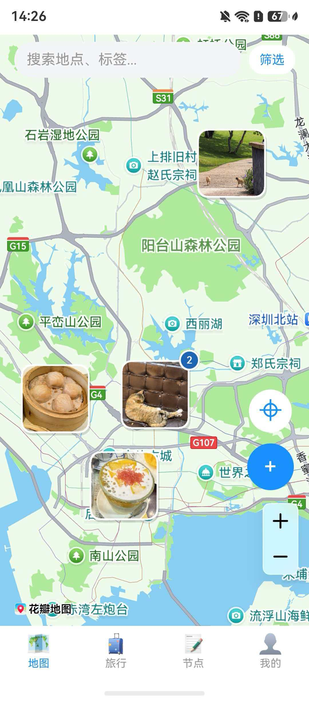
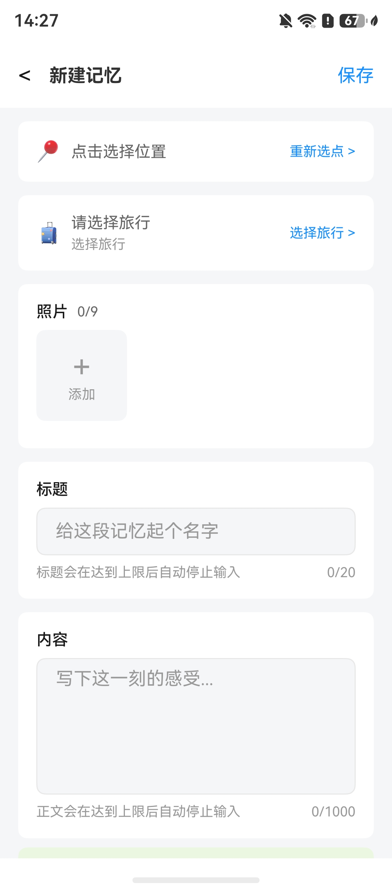
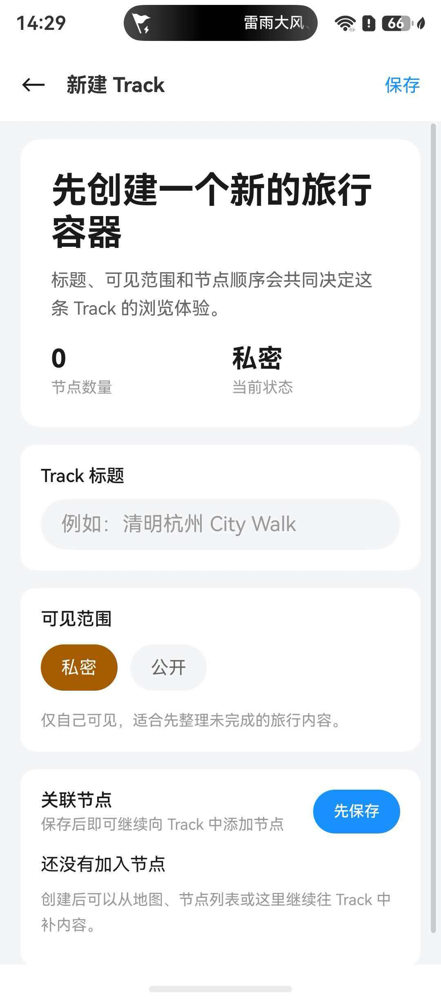
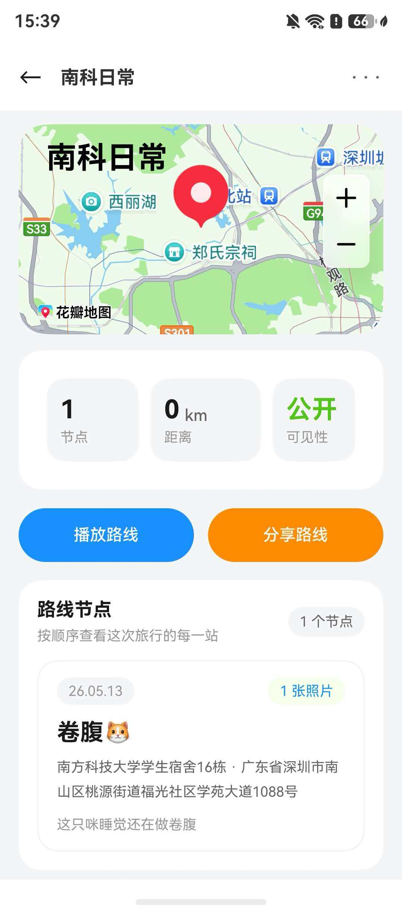
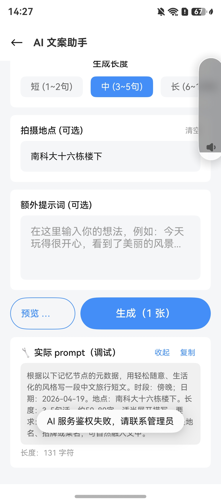
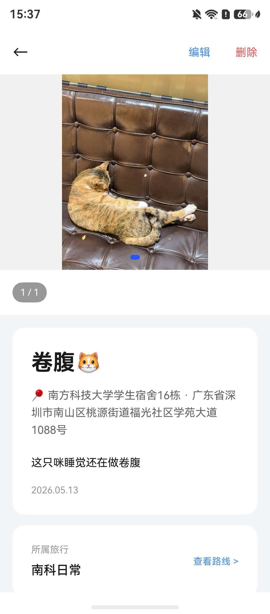

[](https://classroom.github.com/a/py413vYq)

# TravelPin

TravelPin 是一个基于 HarmonyOS 的旅行记忆应用，帮助用户将照片和地点绑定到地图上，并按旅行线路进行组织，同时支持生成 AI 旅行文案，方便记录与分享旅途中的精彩瞬间。

本 README 介绍项目的核心功能、安装与配置方法、运行方式，以及几个简单的使用示例，方便新用户快速上手。

## 项目亮点

- 地图记忆标记：在地图上创建带有位置、照片、标题和正文的记忆节点。
- 旅行 Track 管理：按一次旅行组织节点、路线顺序和可见范围。
- 节点集中浏览：既可以从地图查看，也可以从节点列表统一管理。
- AI 文案助手：结合照片元数据、地点和提示词生成中文旅行短文案。
- 华为账号登录与云同步：支持使用 Huawei ID 登录，并将云端数据同步到本地。
- 本地优先存储：当前项目默认接入 RDB 数据服务。
- 分享能力基础设施：项目中已包含分享模块与后端接口配置。
- 多设备无缝同步：记忆节点、路线和草稿通过华为云空间在手机、平板、电脑之间自动同步。
- 跨平台路线分享：支持直接分享至微信，支持直接分享至微信。

## 系统截图

| 地图主页 | 新建记忆 |
|---|---|
|  |  |

| 新建 Track | Track 详情 |
|---|---|
|  |  |

| AI 文案助手 | 节点详情 丨
|---|---|
|  | |

## 技术栈

- HarmonyOS NEXT / ArkTS
- DevEco Studio
- Hvigor 构建系统
- 华为账号认证 `@hw-agconnect/auth`
- 本地 RDB 数据存储
- HTTPS 后端服务接口

## 项目结构

```text
team-project-26spring-26s-7/
+-- frontend/                         # HarmonyOS 前端工程
|   +-- AppScope/                     # 应用级配置与资源
|   +-- entry/src/main/ets/
|   |   +-- common/                   # 公共服务、数据层、工具类、同步能力
|   |   +-- feature/
|   |   |   +-- ai-copy/              # AI 文案生成功能
|   |   |   +-- map-travel/           # 地图、旅行、节点、回放等功能
|   |   |   +-- profile/              # 个人中心
|   |   |   +-- social-share/         # 分享相关模块
|   |   +-- pages/                    # 应用入口页面
|   +-- scripts/                      # 构建辅助脚本
+-- references/                       # 架构、设计与参考文档
+-- docs/readme-assets/               # README 配图
+-- README.md
```

## 环境要求

在运行项目之前，请先准备以下环境：

- Windows 开发环境
- DevEco Studio
- HarmonyOS SDK
- HarmonyOS 模拟器或真机设备
  
## 安装与配置

### 1. 克隆项目

```bash
git clone https://github.com/sustech-cs304/team-project-26spring-26s-7.git
cd team-project-26spring-26s-7
```

### 2. 用 DevEco Studio 打开工程

- 以 `frontend/` 目录作为 HarmonyOS 工程根目录打开

### 3. 同步依赖

- 打开工程后，等待 DevEco Studio 自动完成同步
- 或者使用 DevEco 内置的 Hvigor 同步与构建流程

### 4. 检查服务配置

如果需要联调 AI、分享或云端功能，请关注以下配置：

- 接口配置文件：`frontend/entry/src/main/ets/common/api/ApiEndpoints.ets`
- 当前后端基础地址：`https://audit.itsmappin.top:8443`
- 华为账号登录、云同步、AI 生成等能力依赖本地 DevEco 配置与可用的后端服务

## 运行方式

通过 DevEco Studio 运行

1. 在 DevEco Studio 中打开 `frontend/`
2. 等待工程同步完成
3. 选择模拟器或已连接的 HarmonyOS 设备
4. 点击 Run 运行应用

## 快速上手示例

### 示例 1：创建一个记忆节点

1. 打开应用，进入地图页
2. 点击右侧添加按钮
3. 选择地点
4. 上传或拍摄照片
5. 输入标题和内容（可以选择添加该节点到一条旅行、添加心情、标签和用ai辅助生成文案）
6. 点击保存

效果：该记忆会作为一个节点显示在地图上。

### 示例 2：创建一条旅行 Track

1. 进入 `旅行` 页签
2. 点击新建 Track
3. 输入 Track 标题
4. 选择可见范围，例如私密或公开
5. 点击保存
6. 保存后继续向 Track 中添加节点

效果：用户可以用这条 Track 来组织整段旅行中的路线、节点顺序和分享范围。

### 示例 3：使用 AI 文案助手

1. 打开 AI 文案助手页面
2. 选择文案长度
3. 填写可选的拍摄地点
4. 输入额外提示词
5. 生成对应文案

效果：系统会根据图片元数据、地点和提示信息生成一段中文旅行文案。

## 主要用户流程

- 使用华为账号登录应用
- 从云端同步个人数据到本地
- 在地图中浏览已有记忆节点
- 创建新节点并添加照片
- 将节点组织进旅行 Track
- 在旅行列表中查看和编辑 Track
- 使用 AI 助手生成旅行短文案

## 关键文件说明

- `frontend/entry/src/main/ets/pages/LoginPage.ets`：华为账号登录流程
- `frontend/entry/src/main/ets/pages/MainPage.ets`：应用底部 Tab 主框架
- `frontend/entry/src/main/ets/common/ServiceConfig.ets`：数据服务模式配置
- `frontend/entry/src/main/ets/common/api/ApiEndpoints.ets`：后端接口配置
- `frontend/build.ps1`：简单构建入口
- `frontend/scripts/Invoke-HarmonyBuild.ps1`：更完整的 PowerShell 构建脚本

## 已知问题与限制

- 离线地图模式下暂不支持地址解析；如果设备无法访问在线地图或逆地理编码服务，位置可能只能以坐标形式展示。
- 项目域名仍在申请配置中，当前后端使用临时域名与非标准端口
- Replay 回放界面目前采用读条式行进，动画流畅度仍有优化空间。
- 文件传输链路仍以功能可用为优先，大文件或弱网环境下传输效率较低，后续可考虑分片上传、断点续传或压缩策略。
- AI 文案服务受上游 AI 服务能力限制，目前最多支持约 30 个并发请求；超过该并发量时可能触发排队、限流或请求失败。

## 更多资源

- [后端服务部署与 API 调试说明](backend/README.md)：包含 AI relay、敏感词过滤、图片审核、分享服务的启动、验证和故障排查方式。
- [项目文档索引](documents/README.md)：按设计、部署、功能、测试等类别整理的项目文档入口。
- [后端接口配置文件](frontend/entry/src/main/ets/common/api/ApiEndpoints.ets)：前端调用 AI、分享等服务时使用的基础地址配置。
- [Replay 功能文档](documents/features/replay/)：Replay 相关方案、调研与媒体资源。
- [Social Share 功能文档](documents/features/social-share/)：分享功能需求、接口与集成说明。
- [AI Copy 功能文档](documents/features/ai-copy/)：AI 文案功能相关说明。


## License

MIT License
