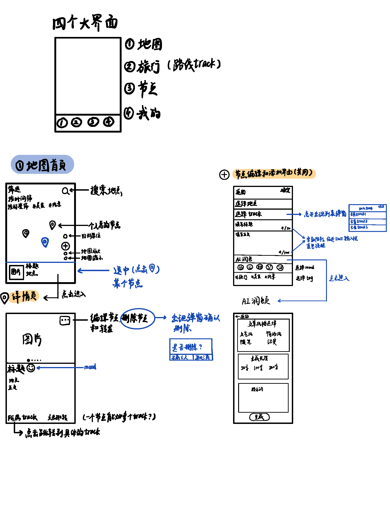
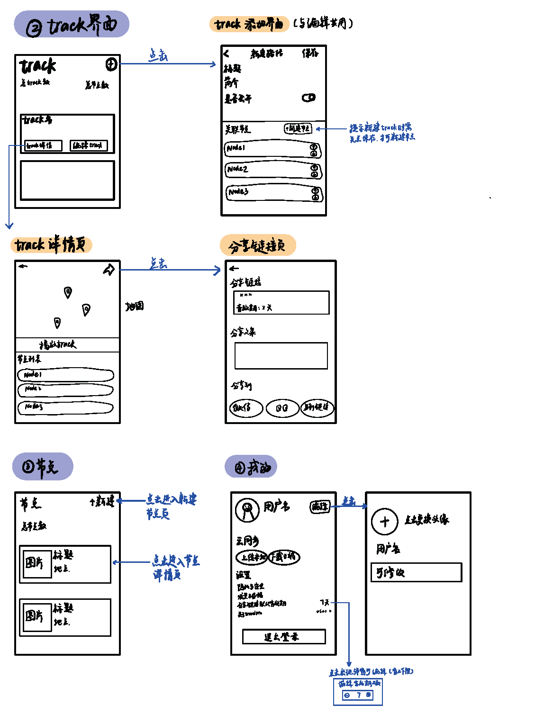

# Architecture & UI Design

**项目名称**: TravelPin - 鸿蒙地理位置旅行日记应用  
**团队**: Southern University of Science and Technology - Software Engineering (2026 Spring) - Group 7  
**文档日期**: 2026-04-20

---

## 1. Architectural Design

### 1.1 Overview

TravelPin 采用 **三层架构 + 离线优先** 的设计模式，将系统划分为 Product、Feature、Common 三层，确保模块解耦、可维护性和可扩展性。

---

### 1.2 System Context Diagram

**图名**: C4 Level 1 - 系统上下文图  
展示 TravelPin 应用与外部系统的边界关系，明确系统职责与外部依赖。

**关键要素**:
- **用户角色**: 旅行者（核心用户）、管理员（后台运维）
- **本系统**: TravelPin App（鸿蒙原生应用，包含前端UI、本地RDB数据库）
- **外部依赖**:
  - 华为账号服务（OAuth 2.0认证）
  - 华为云存储OSS（原始照片存储）
  - 自建服务器API（AI文案生成、内容审核、分享验证）
  - 微信/QQ（第三方社交平台分享）

---

### 1.3 Container Architecture Diagram

**图名**: C4 Level 2 - 容器架构图  
展示三层架构（Product → Feature → Common）及各层组件的依赖关系。

**三层架构说明**:

| 层级 | 职责 | 核心组件 |
|------|------|---------|
| **Product Layer** | 产品定制层，负责应用入口和页面路由 | EntryAbility, Index, LoginPage, MainPage |
| **Feature Layer** | 基础特性层，封装独立功能模块 | map-travel, replay, ai-copy, social-share, cross-device |
| **Common Layer** | 公共能力层，提供可复用的基础服务 | repository, auth, location, utils, media, api, ml, security |

---

### 1.4 Feature Module Details

#### 1.4.1 map-travel (地图旅行)

**图名**: Feature 子图 - map-travel  
展示地图旅行模块的功能组件及其依赖的公共能力。

**核心功能**:
- 地图渲染与Marker管理（MapManager）
- 节点CRUD操作（NodeManager）
- 照片上传到华为云OSS（PhotoUploader）

---

#### 1.4.2 replay (轨迹回放)

**图名**: Feature 子图 - replay  
展示轨迹回放模块的功能组件及其依赖的公共能力。

**核心功能**:
- 时间线播放控制（TimelineController）
- 照片卡片渲染与叠加（PhotoCardRenderer）
- 背景音乐播放（AudioPlayer）
- 相机视角变换动画（CameraAnimator）

---

#### 1.4.3 ai-copy (AI文案生成)

**图名**: Feature 子图 - ai-copy  
展示AI文案生成模块的功能组件及其依赖的公共能力。

**核心功能**:
- 本地图像标签提取（LocalImageTagger）
- 旅程元数据聚合（MetadataAggregator）
- 文案生成与API调用（AiCopyGenerator）

---

#### 1.4.4 social-share (社交分享)

**图名**: Feature 子图 - social-share  
展示社交分享模块的功能组件及其依赖的公共能力。

**核心功能**:
- 分享链接生成（ShareLinkGenerator）
- 二维码渲染（QRCodeRenderer）
- 链接验证（ShareValidator）

---

#### 1.4.5 cross-device (跨设备同步)

**图名**: Feature 子图 - cross-device  
展示跨设备同步模块的功能组件及其依赖的公共能力。

**核心功能**:
- 华为云同步适配（CloudSyncAdapter）
- 页面/功能自适应（DeviceAdapter）
- 同步冲突解决（ConflictResolver）

---

### 1.5 Architecture Design Motivation

#### 三层架构选择理由

采用 **Product → Feature → Common** 三层架构，原因如下：

1. **职责清晰**: Product负责产品定制，Feature负责功能封装，Common负责公共能力
2. **模块解耦**: 每个Feature模块独立，可单独开发、测试、维护
3. **可扩展性**: 新增Feature只需依赖Common层，无需修改现有模块
4. **复用性**: Common层可跨多个Feature共享，减少重复代码

#### 离线优先架构

采用 **离线优先** 设计，数据优先存储在本地RDB，云端作为备份：

- **数据主权**: 原始照片存储于华为云OSS（不出华为生态）
- **隐私保护**: 元数据由自建服务器处理，原始照片永不上传
- **高可用性**: 本地优先响应，云端异步同步
- **跨设备同步**: 华为云空间实现多设备数据一致性

#### 安全设计前置

- **HMAC签名**: 保证分享链接完整性，防止篡改
- **EXIF剥离**: 上传前移除照片元数据，保护用户隐私
- **OAuth 2.0**: 接入华为账号服务，无需自建认证系统

---

## 2. UI Design

### 2.1 Overview

本项目的UI设计采用 **简约地图导向** 设计理念，以地图为核心视觉元素，照片卡片为辅助信息展示。

**设计文档**: 详见 `ui_design_page_1.png` 与 `ui_design_page_2.png`

---

### 2.2 Primary User Interfaces

**图名**: UI Design Page 1  

---

**图名**: UI Design Page 2  

---

### 2.4 Page Routes Diagram

**图名**: 页面路由图  
展示14个注册页面的跳转路径和触发条件，与架构图的组件视角互补。