# C4 Level 2 - 容器图 (Container Diagram)

**生成日期**: 2026-04-20  
**系统名称**: TravelPin 鸿蒙应用  
**分析范围**: `frontend/entry/src/main/ets/`

---

## 设计说明

本文档采用 **分层表达策略**，将复杂架构拆分为两个视角：

1. **架构图（功能组件 + 依赖关系视角）**：展示三层架构、Feature的功能组件、对Common的依赖
2. **导航流程图（页面跳转视角）**：展示页面跳转路径、触发条件（见 Page_Routes.md）

---

## Mermaid 架构图（功能组件视角）

**核心思路**：
- **三层蛋糕结构**：Product → Feature → Common 垂直排列
- **Feature层聚焦功能组件**：不列举页面，而是描述"这个feature依赖哪些公共能力"
- **Common层合并service+data**：统一为 `repository`（数据仓库）
- **新增ml和security模块**：华为ML Kit、安全组件

```mermaid
flowchart TB
    %% 样式定义
    classDef entry fill:#1168bd,stroke:#0b4a8a,stroke-width:2px,color:#fff
    classDef feature fill:#ff9800,stroke:#e65100,stroke-width:2px,color:#fff
    classDef common fill:#4caf50,stroke:#2e7d32,stroke-width:2px,color:#fff
    classDef repo fill:#9c27b0,stroke:#6a1b9a,stroke-width:2px,color:#fff
    classDef component fill:#f5f5f5,stroke:#333,stroke-width:1px,color:#000

    %% ==================== Product Layer ====================
    subgraph ProductLayer["Product Layer - 产品定制层"]
        direction LR
        
        subgraph EntryModule["entry (应用入口)"]
            EntryAbility["EntryAbility<br/>应用入口"]:::entry
        end
        
        subgraph PagesModule["pages (页面层)"]
            direction TB
            Index["Index<br/>启动页"]:::entry
            LoginPage["LoginPage<br/>登录页"]:::entry
            MainPage["MainPage<br/>主页(4个Tab)"]:::entry
        end
    end

    %% ==================== Feature Layer ====================
    subgraph FeatureLayer["Feature Layer - 基础特性层"]
        direction LR
        
        %% map-travel 模块
        subgraph MapTravelModule["map-travel (地图旅行)"]
            direction TB
            MapManager["MapManager<br/>地图渲染+Marker管理"]:::component
            NodeManager["NodeManager<br/>节点CRUD逻辑"]:::component
            PhotoUploader["PhotoUploader<br/>照片上传"]:::component

            %% 依赖说明
            Dep1["依赖: repository + location + auth(CloudStorage) + utils(PhotoPickerUtil)"]:::feature
        end

        %% replay 模块
        subgraph ReplayModule["replay (轨迹回放)"]
            direction TB
            TimelineController["TimelineController<br/>时间线播放控制"]:::component
            PhotoCardRenderer["PhotoCardRenderer<br/>照片卡片渲染"]:::component
            AudioPlayer["AudioPlayer<br/>背景音乐"]:::component
            CameraAnimator["CameraAnimator<br/>相机视角变换"]:::component

            Dep2["依赖: repository + media + location"]:::feature
        end
        
        %% ai-copy 模块
        subgraph AiCopyModule["ai-copy (AI文案生成)"]
            direction TB
            LocalImageTagger["LocalImageTagger<br/>本地图像标签提取"]:::component
            MetadataAggregator["MetadataAggregator<br/>旅程元数据聚合"]:::component
            AiCopyGenerator["AiCopyGenerator<br/>文案生成+API调用"]:::component
            StyleSelector["StyleSelector<br/>风格选择器UI"]:::component
            
            Dep3["依赖: ml + repository + api"]:::feature
        end
        
        %% social-share 模块
        subgraph SocialShareModule["social-share (社交分享)"]
            direction TB
            ShareLinkGenerator["ShareLinkGenerator<br/>分享链接生成"]:::component
            QRCodeRenderer["QRCodeRenderer<br/>二维码渲染"]:::component
            ShareValidator["ShareValidator<br/>链接验证"]:::component

            Dep4["依赖: security + repository + api"]:::feature
        end
        
        %% cross-device 模块
        subgraph CrossDeviceModule["cross-device (跨设备同步)"]
            direction TB
            CloudSyncAdapter["CloudSyncAdapter<br/>华为云同步适配"]:::component
            DeviceAdapter["DeviceAdapter<br/>页面/功能自适应"]:::component
            ConflictResolver["ConflictResolver<br/>同步冲突解决"]:::component
            
            Dep5["依赖: auth(CloudSync) + repository"]:::feature
        end
    end

    %% ==================== Common Layer ====================
    subgraph CommonLayer["Common Layer - 公共能力层"]
        direction LR
        
        %% repository 子模块 (合并service+data)
        subgraph RepositoryModule["repository (数据仓库)"]
            direction TB
            IDataService["IDataService<br/>数据服务接口"]:::repo
            RdbDataService["RdbDataService<br/>RDB本地实现"]:::repo
            TravelRepo["TravelRepo<br/>旅行仓库"]:::repo
            MemoryNodeRepo["MemoryNodeRepo<br/>节点仓库"]:::repo
            Types["types<br/>MemoryNode/Trip"]:::repo
            
            %% 内部关系
            IDataService -->|"implements"| RdbDataService
            RdbDataService -->|"uses"| TravelRepo
            RdbDataService -->|"uses"| MemoryNodeRepo
            TravelRepo -->|"uses"| Types
            MemoryNodeRepo -->|"uses"| Types
        end
        
        %% auth 子模块 (认证+云存储+云同步)
        subgraph AuthModule["auth (认证+云存储)"]
            direction TB
            AuthService["AuthService<br/>华为账号认证"]:::common
            CloudStorageService["CloudStorageService<br/>华为云OSS上传"]:::common
            CloudSyncService["CloudSyncService<br/>华为云空间同步"]:::common

            AuthService -->|"登录后"| CloudStorageService
            AuthService -->|"登录后"| CloudSyncService
        end
        
        %% location 子模块
        subgraph LocationModule["location (地图定位)"]
            direction TB
            MapService["MapService<br/>地点搜索"]:::common
            LocationService["LocationService<br/>定位服务"]:::common
        end
        
        %% utils 子模块
        subgraph UtilsModule["utils (工具类)"]
            direction TB
            Logger["Logger<br/>日志工具"]:::common
            Constants["Constants<br/>颜色/路由/尺寸"]:::common
            PhotoPickerUtil["PhotoPickerUtil<br/>照片选择+沙箱"]:::common
        end

        %% media 子模块
        subgraph MediaModule["media (媒体服务)"]
            direction TB
            AudioService["AudioService<br/>音频播放"]:::common
        end

        %% api 子模块 (HTTP客户端)
        subgraph ApiModule["api (网络服务)"]
            direction TB
            HttpClient["HttpClient<br/>HTTP请求封装"]:::common
            AiGatewayClient["AiGatewayClient<br/>AI网关客户端"]:::common
        end

        %% ml 子模块 (华为ML Kit)
        subgraph MlModule["ml (机器学习)"]
            direction TB
            ImageTagger["ImageTagger<br/>图像标签提取"]:::common
        end

        %% security 子模块
        subgraph SecurityModule["security (安全组件)"]
            direction TB
            ShareLinkSigner["ShareLinkSigner<br/>HMAC签名"]:::common
            ExifStripper["ExifStripper<br/>EXIF剥离"]:::common
        end
    end

    %% ==================== 层级调用关系 ====================
    
    %% Product -> Feature
    ProductLayer ==>|"路由分发"| FeatureLayer
    
    %% Product -> Common
    PagesModule -.->|"华为账号认证"| AuthModule
    
    %% Feature -> Common (按模块聚合)
    MapTravelModule -.->|"数据CRUD"| RepositoryModule
    MapTravelModule -.->|"地图定位"| LocationModule
    MapTravelModule -.->|"照片上传(CloudStorage)"| AuthModule
    MapTravelModule -.->|"照片选择(PhotoPickerUtil)"| UtilsModule

    ReplayModule -.->|"数据读取"| RepositoryModule
    ReplayModule -.->|"音乐播放"| MediaModule
    ReplayModule -.->|"相机动画"| LocationModule

    AiCopyModule -.->|"图像分析"| MlModule
    AiCopyModule -.->|"元数据聚合"| RepositoryModule
    AiCopyModule -.->|"API调用"| ApiModule

    SocialShareModule -.->|"链接签名"| SecurityModule
    SocialShareModule -.->|"旅行数据"| RepositoryModule
    SocialShareModule -.->|"链接验证"| ApiModule

    CrossDeviceModule -.->|"云同步"| AuthModule
    CrossDeviceModule -.->|"数据同步"| RepositoryModule

    %% Common 内部调用
    AuthModule -->|"认证后同步"| RepositoryModule
    MediaModule -->|"日志"| UtilsModule

    %% 布局优化
    linkStyle default stroke:#666,stroke-width:2px
```



---

## 模块职责说明

### Feature Layer (基础特性层)

| 模块 | 核心能力 | 功能组件 | 依赖的Common模块 |
|------|---------|---------|-----------------|
| **map-travel** | 地图渲染 + 节点管理 + 照片上传 | MapManager, NodeManager, PhotoUploader | **repository(强)**, location, auth(CloudStorage), utils(PhotoPickerUtil) |
| **replay** | 轨迹回放 + 照片叠加 + 音乐播放 + 相机动画 | TimelineController, PhotoCardRenderer, AudioPlayer, CameraAnimator | repository, media, location |
| **ai-copy** | 本地图像分析 + 元数据聚合 + 文案生成 | LocalImageTagger, MetadataAggregator, AiCopyGenerator | **ml**, repository, api |
| **social-share** | 分享链接生成 + 二维码 + 验证 | ShareLinkGenerator, QRCodeRenderer, ShareValidator | **security**, repository, api |
| **cross-device** | 华为云同步 + 设备适配 + 冲突解决 | CloudSyncAdapter, DeviceAdapter, ConflictResolver | **auth(CloudSync)**, repository |

### Common Layer (公共能力层)

| 模块 | 职责 | 核心组件 | 说明 |
|------|------|---------|------|
| **repository** | 本地数据仓库 | IDataService, RdbDataService, Repositories | 合并原service+data，统一数据入口 |
| **auth** | 认证 + 云存储 + 云同步 | AuthService, CloudStorageService, CloudSyncService | 华为账号认证 + 华为云OSS + 华为云空间同步 |
| **location** | 地图定位 | MapService, LocationService | 华为地图SDK封装 |
| **utils** | 工具类 | Logger, Constants, PhotoPickerUtil | 通用工具（日志、常量、照片选择） |
| **media** | 媒体服务 | AudioService | 音频播放 |
| **api** | 网络服务 | HttpClient, AiGatewayClient | HTTP请求封装、AI网关客户端 |
| **ml** | 机器学习 | ImageTagger | 华为ML Kit图像标签提取 |
| **security** | 安全组件 | ShareLinkSigner, ExifStripper | HMAC签名、EXIF剥离 |

---

## 数据流向

```
用户交互 → Product Pages → Feature 功能组件 → Common 公共能力
                                        ↓
                                repository.IDataService
                                        ↓
                          ┌─────────────┴─────────────┐
                          ↓                           ↓
                    RdbDataService              CloudSyncService
                    (本地RDB)                   (华为云备份)
```

---

## 设计动机

1. **Feature层聚焦"功能组件"**：与页面路由图职责分离，避免重复
2. **repository统一数据入口**：合并service+data，减少概念混淆
3. **依赖关系清晰**：每个Feature明确标注依赖的Common模块
4. **新增ml和security**：对应AI文案和分享功能的需求

---

## 与页面路由图的互补关系

| 图表 | 视角 | 内容 |
|------|------|------|
| **架构图 (本图)** | 功能组件 + 依赖关系 | Feature的功能组件如何依赖Common |
| **页面路由图** | 页面跳转 + 触发条件 | 用户点击如何触发页面跳转 |

---

## 工具链

```bash
mmdc -i C4_Level2_Container.md -o C4_Level2_Container_Architecture.svg -w 2400 -b white
```

---

**上一张**: [C4 Level 1 - 系统上下文图](./C4_Level1_SystemContext.md)  
**下一张**: [页面路由图](./C4_Level2_Container_Page_Routes.md)