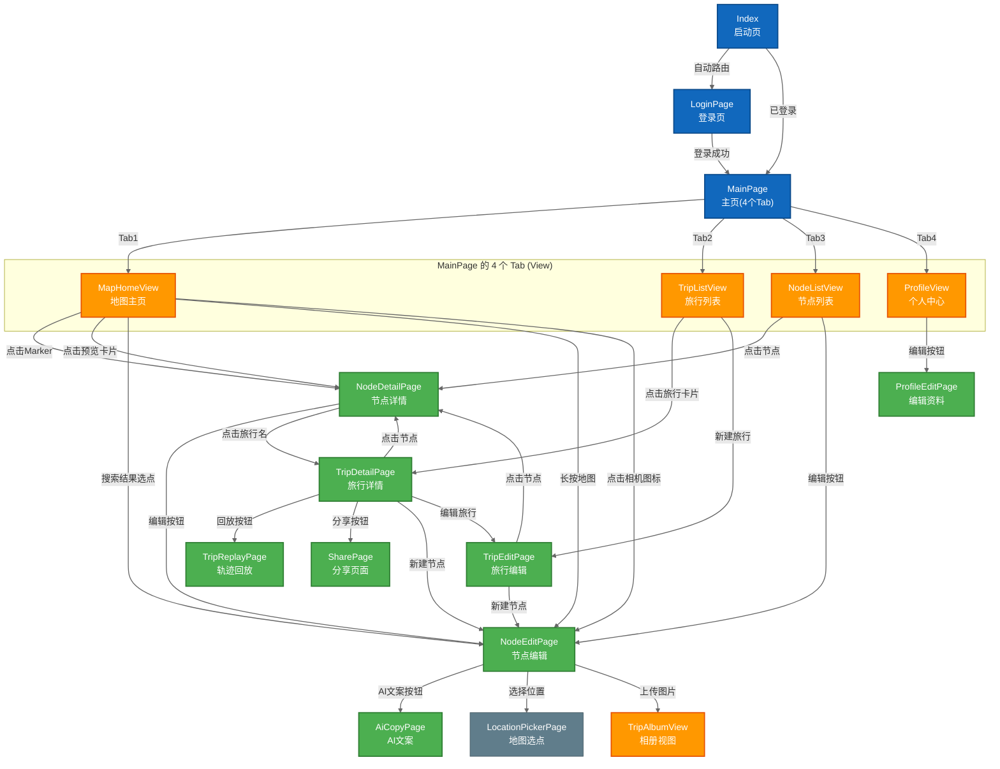

# Page Routes - 页面路由图

**生成日期**: 2026-04-18  
**数据来源**: 
- `main_pages.json` (路由配置)
- `router.pushUrl()` 实际调用代码

---

## 注册页面列表

根据 `main_pages.json`，共注册 **14 个页面**：

| 序号 | 路由路径 | 页面名称 |
|-----|---------|---------|
| 1 | `pages/Index` | Index (启动页) |
| 2 | `pages/LoginPage` | LoginPage (登录页) |
| 3 | `pages/MainPage` | MainPage (主页) |
| 4 | `feature/map-travel/pages/NodeEditPage` | NodeEditPage (节点编辑) |
| 5 | `feature/map-travel/pages/NodeDetailPage` | NodeDetailPage (节点详情) |
| 6 | `feature/map-travel/pages/TripEditPage` | TripEditPage (旅行编辑) |
| 7 | `feature/map-travel/pages/TripDetailPage` | TripDetailPage (旅行详情) |
| 8 | `feature/map-travel/pages/TripReplayPage` | TripReplayPage (轨迹回放) |
| 9 | `feature/map-travel/pages/LocationPickerPage` | LocationPickerPage (地图选点) |
| 10 | `feature/social-share/pages/SharePage` | SharePage (分享页面) |
| 11 | `feature/ai-copy/pages/AiCopyPage` | AiCopyPage (AI文案) |
| 12 | `feature/profile/pages/ProfileEditPage` | ProfileEditPage (编辑资料) |

---

## Mermaid 路由图（基于实际代码）



---

## 路由统计表

| 源页面 | 可跳转目标数量 | 目标页面 |
|-------|--------------|---------|
| **Index** | 2 | LoginPage, MainPage |
| **LoginPage** | 1 | MainPage |
| **MainPage** | 4 | MapHomeView, TripListView, NodeListView, ProfileView |
| **MapHomeView** | 2 | NodeDetail, NodeEdit |
| **TripListView** | 2 | TripDetail, TripEdit |
| **TripDetailPage** | 5 | NodeDetail, TripReplay, SharePage, NodeEdit, TripEdit |
| **NodeListView** | 2 | NodeDetail, NodeEdit |
| **NodeDetailPage** | 2 | NodeEdit, TripDetail |
| **NodeEditPage** | 3 | AiCopyPage, LocationPickerPage, TripAlbumView |
| **TripEditPage** | 2 | NodeDetail, NodeEdit |
| **ProfileView** | 1 | ProfileEditPage |

---

## 代码证据

### Index.ets
```typescript
// 自动路由到 LoginPage 或 MainPage
if (isLoggedIn) {
  router.replaceUrl({ url: RouterUrls.MAIN })
} else {
  router.replaceUrl({ url: RouterUrls.LOGIN })
}
```

### MapHomeView.ets
```typescript
// Line 348: 点击搜索结果
router.pushUrl({ url: RouterUrls.NODE_EDIT, params: { ... } })

// Line 517: 长按地图
router.pushUrl({ url: RouterUrls.NODE_EDIT, params: { ... } })

// Line 744: 点击相机图标
router.pushUrl({ url: RouterUrls.NODE_EDIT })

// Line 810: 点击 Marker
router.pushUrl({ url: RouterUrls.NODE_DETAIL, params: { nodeId } })
```

### TripDetailPage.ets
```typescript
// Line 430: 点击节点
router.pushUrl({ url: RouterUrls.NODE_DETAIL, params: { nodeId } })

// Line 498: 回放按钮
router.pushUrl({ url: RouterUrls.TRIP_REPLAY, params: { tripId } })

// Line 510: 分享按钮
router.pushUrl({ url: RouterUrls.SHARE, params: { tripId } })

// Line 598: 新建节点
router.pushUrl({ url: RouterUrls.NODE_EDIT, params: { tripId } })

// Line 611: 编辑旅行
router.pushUrl({ url: RouterUrls.TRIP_EDIT, params: { tripId } })
```

---

## 工具链

```bash
mmdc -i Page_Routes.md -o Page_Routes.svg -w 1800 -b white
```