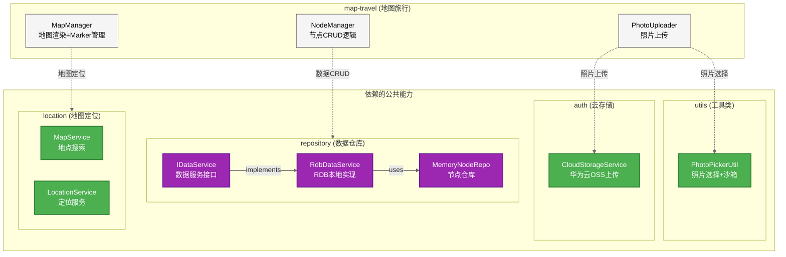
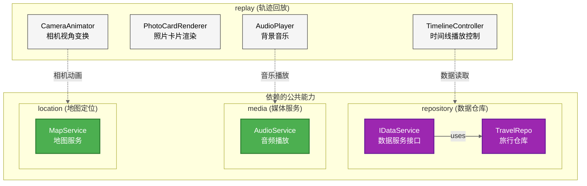
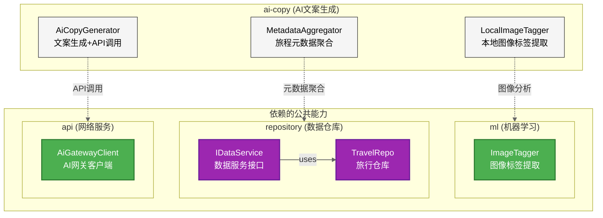
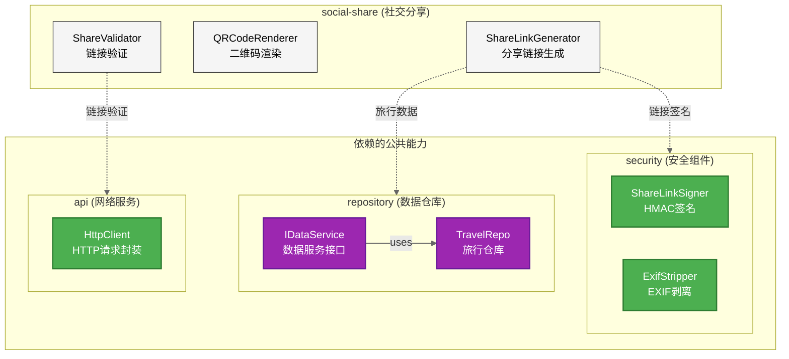
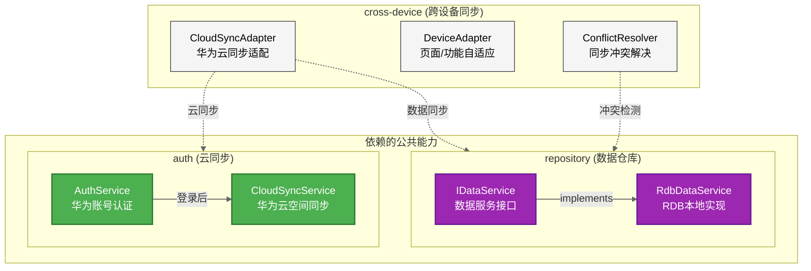

# C4 Level 2 - Feature 子图系列

**生成日期**: 2026-04-20
**用途**: 将架构图分解为5个Feature子图，便于文档引用

---

## 1. map-travel (地图旅行)



---

## 2. replay (轨迹回放)



---

## 3. ai-copy (AI文案生成)



---

## 4. social-share (社交分享)



---

## 5. cross-device (跨设备同步)



---

## 工具链

```bash
# 生成所有子图
mmdc -i C4_Level2_Feature_Subgraphs.md -o C4_Level2_Feature_map-travel.svg -w 800 -b white
mmdc -i C4_Level2_Feature_Subgraphs.md -o C4_Level2_Feature_replay.svg -w 800 -b white
mmdc -i C4_Level2_Feature_Subgraphs.md -o C4_Level2_Feature_ai-copy.svg -w 800 -b white
mmdc -i C4_Level2_Feature_Subgraphs.md -o C4_Level2_Feature_social-share.svg -w 800 -b white
mmdc -i C4_Level2_Feature_Subgraphs.md -o C4_Level2_Feature_cross-device.svg -w 800 -b white
```