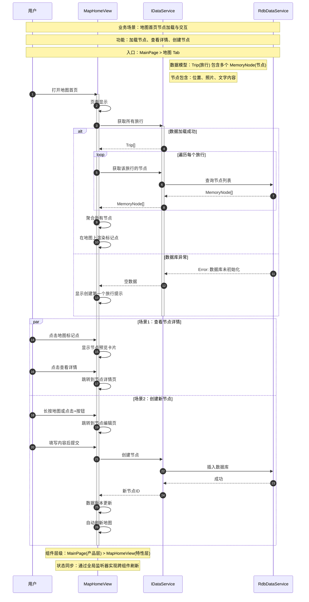

# C4 Level 3 - 组件图 (Component Diagram)

**生成日期**: 2026-04-16  
**分析范围**: `feature/map-travel` 模块（地图旅行核心）  
**设计模式**: MVVM (Model-View-ViewModel)

---

## Mermaid 架构图

```mermaid
flowchart TB
  %% 样式定义
  classDef page fill:#1168bd,stroke:#0b4a8a,stroke-width:2px,color:#fff
  classDef view fill:#ff9800,stroke:#e65100,stroke-width:2px,color:#fff
  classDef component fill:#4caf50,stroke:#2e7d32,stroke-width:2px,color:#fff
  classDef vm fill:#9c27b0,stroke:#6a1b9a,stroke-width:2px,color:#fff
  classDef repo fill:#607d8b,stroke:#455a64,stroke-width:2px,stroke-dasharray:5 5,color:#fff
  classDef service fill:#7b1fa2,stroke:#4a148c,stroke-width:2px,color:#fff

  subgraph MapTravel
    direction TB

    subgraph Pages
      NodeEditPage["NodeEditPage.ets - 节点编辑页面"]:::page
      NodeDetailPage["NodeDetailPage.ets - 节点详情页面"]:::page
      TripDetailPage["TripDetailPage.ets - 旅行详情页面"]:::page
      TripReplayPage["TripReplayPage.ets - 轨迹回放页面"]:::page
      LocationPickerPage["LocationPickerPage.ets - 地图选点页面"]:::page
    end

    subgraph Views
      MapHomeView["MapHomeView.ets - 地图首页视图"]:::view
      TripListView["TripListView.ets - 旅行列表视图"]:::view
      TripAlbumView["TripAlbumView.ets - 旅行相册视图"]:::view
      NodeListView["NodeListView.ets - 节点列表视图"]:::view
    end

    subgraph Components
      PhotoSelector["PhotoSelector.ets - 照片选择器"]:::component
      ReplayPhotoCard["ReplayPhotoCard.ets - 回放照片卡片"]:::component
      ReplayProgressBar["ReplayProgressBar.ets - 回放进度条"]:::component
      PhotoCardOverlay["PhotoCardOverlay.ets - 照片叠加层"]:::component
    end

    subgraph ViewModel
      MapHomeVM["MapHomeView 状态管理"]:::vm
    end
  end

  subgraph Common
    IDataService["IDataService.ets - 数据服务接口"]:::service
    RdbDataService["RdbDataService.ets - RDB 数据服务"]:::service
    Types["types.ets - MemoryNode/Trip 类型"]:::repo
    Logger["Logger.ets - 统一日志工具"]:::repo
    PhotoPickerUtil["PhotoPickerUtil.ets - 照片选择工具"]:::repo
    MapNodeInfo["MapNodeInfo.ets - 地图节点信息类"]:::repo
  end

  %% 页面与视图关系
  NodeEditPage -.-> MapHomeView
  NodeDetailPage -.-> MapHomeView
  TripDetailPage -.-> TripListView
  TripReplayPage -.-> TripAlbumView

  %% Views 调用 Components
  MapHomeView --> PhotoSelector
  TripReplayPage --> ReplayPhotoCard
  TripReplayPage --> ReplayProgressBar
  TripReplayPage --> PhotoCardOverlay

  %% ViewModel 管理 Views
  MapHomeVM --> MapHomeView
  MapHomeVM --> TripListView

  %% Views 调用 Service
  MapHomeView --> IDataService
  TripListView --> IDataService
  NodeEditPage --> IDataService
  NodeDetailPage --> IDataService
  TripDetailPage --> IDataService
  TripReplayPage --> IDataService

  %% Service 实现依赖
  IDataService -.-> RdbDataService
  RdbDataService --> Types
  RdbDataService --> Logger

  %% 工具类依赖
  PhotoSelector --> PhotoPickerUtil
  MapHomeView --> Logger
  MapHomeView --> MapNodeInfo

  %% 数据流
  Types --> MapNodeInfo

  linkStyle default stroke:#666,stroke-width:1px
```



---

## 组件说明

### Pages - 5 个功能页面

| 组件 | 职责 | 关键方法 |
|------|------|---------|
| **NodeEditPage.ets** | 新建/编辑记忆节点 | 接收 `latitude`, `longitude`, `poiName` 参数 |
| **NodeDetailPage.ets** | 查看节点详情 | 显示照片、内容、位置信息 |
| **TripDetailPage.ets** | 旅行详情管理 | 节点列表、路线编辑入口 |
| **TripReplayPage.ets** | 轨迹动画回放 | 控制回放进度、照片卡片展示 |
| **LocationPickerPage.ets** | 地图点击选点 | 返回选中的坐标 |

### Views - 4 个视图

#### MapHomeView.ets (核心视图)

**状态管理**:
```typescript
@State showFilter: boolean           // 筛选面板显示
@State mapNodes: MapNodeInfo[]       // 地图节点数据
@State searchResults: HomeSearchResult[]  // 搜索结果
@StorageLink('travelDataVersion')    // 响应数据变化
@Watch('onTravelDataVersionChange')  // 数据版本监听
```

**核心方法**:
| 方法 | 功能 |
|------|------|
| `loadNodes()` | 从 IDataService 加载所有节点 |
| `syncMarkers()` | 同步地图 Marker 与节点数据 |
| `handleSearchInputChange()` | 处理搜索框输入，查询本地 + 华为地图 API |
| `selectSearchResult()` | 选择搜索结果，飞升到指定位置 |
| `setupMarkerClickListener()` | 监听 Marker 点击，弹出预览卡片 |
| `setupMapLongClickListener()` | 长按地图，快捷创建节点 |

### Components - 4 个 UI 组件

| 组件 | 功能 | 输入参数 |
|------|------|---------|
| **PhotoSelector.ets** | 照片选择网格 | 调用 PhotoPickerUtil |
| **ReplayPhotoCard.ets** | 回放时照片卡片 | `replayNode: ReplayNode` |
| **ReplayProgressBar.ets** | 回放进度控制 | `progress: number`, `onProgressChange` |
| **PhotoCardOverlay.ets** | 照片叠加动画 | 动画过渡效果 |

### Common Layer - 数据模型

**types.ets** 定义的核心类型：
```typescript
interface MemoryNode {
  id: string
  travelId: string
  title: string
  content: string
  latitude: number
  longitude: number
  poiName: string
  photos: string[]
  mood: string
  tags: string[]
  createdAt: number
  updatedAt: number
}

interface Trip {
  id: string
  name: string
  description: string
  coverPhoto: string
  isPublic: boolean
  startDate: number
  endDate: number
  nodeIds: string[]
  totalDistance: number
}
```

---

## 数据流分析

### 1. 节点加载流程

```
MapHomeView.onPageShow()
    ↓
loadNodes()
    ↓
IDataService.getAllTravels() → IDataService.getNodesByTravelId()
    ↓
RdbDataService (查询 RDB)
    ↓
MemoryNodeRepository → RdbHelper (SQL 查询)
    ↓
MapHomeView.loadedNodes (内存缓存)
    ↓
syncMarkers() → mapController.addMarker()
```

### 2. 搜索流程

```
用户输入搜索框
    ↓
handleSearchInputChange(value)
    ↓
buildNodeSearchResults(keyword) [本地节点过滤]
    ↓
searchSites(keyword) [华为地图 API]
    ↓
site.searchByText() → 合并结果
    ↓
searchResults (UI 展示)
```

### 3. 创建节点流程

```
用户长按地图 / 点击"+"按钮
    ↓
router.pushUrl(RouterUrls.NODE_EDIT, { latitude, longitude })
    ↓
NodeEditPage 接收参数
    ↓
用户填写标题、内容、选择照片
    ↓
IDataService.createNode(CreateNodeInput)
    ↓
RdbDataService.insert() → 触发 travelDataVersion 更新
    ↓
MapHomeView.onTravelDataVersionChange() → 自动刷新
```

---

## 设计动机

### 1. MVVM 模式实践

- **Model**: `MemoryNode`, `Trip` 类型定义 + RDB 数据存储
- **View**: `MapHomeView`, `TripListView` 等视图组件
- **ViewModel**: 通过 `@State`, `@StorageLink`, `@Watch` 实现响应式状态管理

### 2. 声明式 UI 优势

- 状态变化自动触发 UI 刷新（如 `searchResults` 变化 → 搜索面板更新）
- 使用 `@Watch` 监听全局数据版本，实现跨组件同步

### 3. 依赖倒置原则

- Views 不直接依赖 RDB，通过 `IDataService` 接口访问数据
- 开发阶段可使用 `MockDataService`，生产切换为 `RdbDataService`

---

## 隐藏假设

1. **单线程假设**: 所有数据库操作在异步任务中执行，但 UI 层假设数据已加载完成
2. **内存缓存**: `loadedNodes` 缓存在组件内存中，假设数据量不会过大（<100 个节点）
3. **网络容错**: 搜索流程假设华为地图 API 总是可用，降级策略仅记录日志
4. **坐标精度**: 使用 `0.0001` 作为坐标比较容差，假设足以区分不同位置

---

## 组件交互时序图（优化版）

**设计原则**：业务场景驱动，减少技术细节，增加上下文说明



---

## 工具链建议

```bash
# 转换为 SVG
mmdc -i C4_Level3_Component.md -o C4_Level3_Component.svg -w 1800
```

---

**上一张**: [C4 Level 2 - 容器图](./C4_Level2_Container.md)
