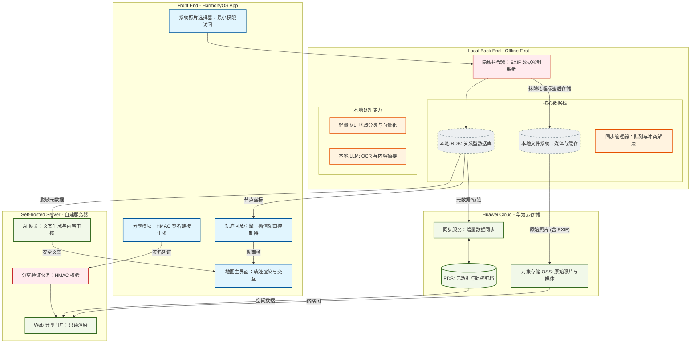

# 旅行记忆地图 - 软件架构图

**最后更新**: 2026-04-09 (架构文档与实际状态同步)

---

## 当前架构 (2026-04-09 更新)

基于三层架构设计：Product (产品定制层) → Feature (基础特性层) → Common (公共能力层)

```mermaid
graph TD
    %% 样式定义 - 三层架构
    classDef product fill:#e3f2fd,stroke:#1565c0,stroke-width:2px;
    classDef feature fill:#fff3e0,stroke:#e65100,stroke-width:2px;
    classDef common fill:#f1f8e9,stroke:#33691e,stroke-width:2px;
    classDef service fill:#f3e5f5,stroke:#7b1fa2,stroke-width:2px;
    classDef storage fill:#eceff1,stroke:#455a64,stroke-dasharray: 5 5;
    classDef pending fill:#ffebee,stroke:#c62828,stroke-width:1px,stroke-dasharray: 3 3;
    classDef security fill:#fce4ec,stroke:#ad1457,stroke-width:2px;

    %% --- Product Layer (产品定制层) ---
    subgraph Product [Product Layer - 产品定制层]
        EntryAbility[EntryAbility.ets: 应用入口]:::product
        Index[Index.ets: 启动页/欢迎页]:::product
        LoginPage[LoginPage.ets: 登录页]:::product
        MainPage[MainPage.ets: 主页入口]:::product
    end

    %% --- Feature Layer (基础特性层) ---
    subgraph Feature [Feature Layer - 基础特性层]
        direction TB

        subgraph MapTravel [map-travel: 地图旅行核心模块]
            MapHomeView[MapHomeView.ets: 地图首页视图]:::feature
            TripListView[TripListView.ets: 旅行列表视图]:::feature
            
            subgraph MapPages [Pages: 5 个功能页面]
                NodeEditPage[NodeEditPage.ets: 节点编辑]:::feature
                NodeDetailPage[NodeDetailPage.ets: 节点详情]:::feature
                TripDetailPage[TripDetailPage.ets: 旅行详情]:::feature
                TripReplayPage[TripReplayPage.ets: 轨迹回放]:::feature
                LocationPickerPage[LocationPickerPage.ets: 地图选点]:::feature
            end
            
            subgraph MapComponents [Components: 4 个组件]
                PhotoSelector[PhotoSelector: 照片选择器]:::feature
                ReplayPhotoCard[ReplayPhotoCard: 回放照片卡片]:::feature
                ReplayProgressBar[ReplayProgressBar: 回放进度条]:::feature
                PhotoCardOverlay[PhotoCardOverlay: 照片叠加层]:::feature
            end
        end

        subgraph Profile [profile: 个人中心模块]
            ProfileView[ProfileView.ets: 个人中心视图]:::feature
            ProfileEditPage[ProfileEditPage.ets: 编辑资料页]:::feature
        end

        subgraph SocialShare [social-share: 社交分享模块]
            SharePage[SharePage.ets: 分享页面]:::feature
            QRCodeShare[QRCodeShare: 二维码分享组件]:::feature
        end

        subgraph AiCopy [ai-copy: AI 文案模块]
            AiCopyPage[AiCopyPage.ets: AI 文案页]:::feature
            AiCopyGenerator[AiCopyGenerator: AI 文案生成组件]:::feature
        end
    end

    %% --- Common Layer (公共能力层) ---
    subgraph Common [Common Layer - 公共能力层]
        direction TB

        subgraph Utils [utils - 已实现 ✅]
            Logger[Logger.ets: 统一日志工具]:::common
            Constants[Constants.ets: 常量定义<br/>AppColors, AppDimens, RouterUrls]:::common
            PhotoPickerUtil[PhotoPickerUtil.ets: 照片选择工具]:::common
        end

        subgraph UtilsPending [utils - 待实现 ⏳]
            EventHub[EventHub.ets: 事件总线]:::pending
            CoordinateConverter[CoordinateConverter.ets: 坐标转换]:::pending
        end

        subgraph Service [service - 已实现 ✅]
            IDataService[IDataService.ets: 数据服务接口]:::service
            MockDataService[MockDataService.ets: 模拟数据服务]:::service
            RdbDataService[RdbDataService.ets: RDB 数据服务]:::service
            DataServiceStub[DataServiceStub.ets: 数据服务桩]:::service
            ServiceConfig[ServiceConfig.ets: 服务配置]:::service
            Types[types.ets: 数据模型<br/>MemoryNode, Trip, ReplayNode]:::service
        end

        subgraph Data [data - 已实现 ✅]
            RdbHelper[RdbHelper.ets: RDB 数据库助手]:::storage
            TravelRepository[TravelRepository.ets: 旅行数据仓库]:::storage
            MemoryNodeRepository[MemoryNodeRepository.ets: 记忆节点仓库]:::storage
        end

        subgraph APIPending [api - 待实现 ⏳]
            HttpClient[HttpClient.ets: HTTP 客户端]:::pending
            FileUploader[FileUploader.ets: 文件上传]:::pending
            ApiEndpoints[ApiEndpoints.ets: API 端点]:::pending
            AiGatewayClient[AiGatewayClient.ets: AI 网关]:::pending
            SharePortalClient[SharePortalClient.ets: 分享门户]:::pending
        end

        subgraph AuthPending [auth - 待实现 ⏳]
            HuaweiAccountAuth[HuaweiAccountAuth.ets: 华为账号认证]:::pending
            SessionManager[SessionManager.ets: 会话管理]:::pending
        end

        subgraph AIPending [ai - 待实现 ⏳]
            LocalImageTagger[LocalImageTagger.ets: 本地图像标签]:::pending
            MetadataAggregator[MetadataAggregator.ets: 元数据聚合]:::pending
        end

        subgraph SecurityPending [security - 待实现 ⏳]
            ExifStripper[ExifStripper.ets: EXIF 脱敏]:::security
            ShareLinkSigner[ShareLinkSigner.ets: HMAC 签名]:::security
        end
    end

    %% --- 数据流关系 (Data Flow) ---
    
    %% 应用入口
    EntryAbility --> Index
    Index --> LoginPage
    Index --> MainPage
    
    %% MainPage 调用 Feature Views
    MainPage --> MapHomeView
    MainPage --> ProfileView
    
    %% Feature Views 调用 Feature Pages
    MapHomeView --> TripListView
    MapHomeView --> NodeEditPage
    MapHomeView --> LocationPickerPage
    TripListView --> TripDetailPage
    TripListView --> TripReplayPage
    TripListView --> AiCopyPage
    TripListView --> SharePage
    
    %% Feature Pages 调用 Components
    TripReplayPage --> ReplayPhotoCard
    TripReplayPage --> ReplayProgressBar
    TripReplayPage --> PhotoCardOverlay
    NodeEditPage --> PhotoSelector
    SharePage --> QRCodeShare
    AiCopyPage --> AiCopyGenerator
    
    %% Feature 调用 Common Service
    MapHomeView --> IDataService
    TripListView --> IDataService
    NodeEditPage --> IDataService
    TripDetailPage --> IDataService
    TripReplayPage --> IDataService
    PhotoSelector --> PhotoPickerUtil
    
    %% Service 层依赖
    IDataService -.-> MockDataService
    IDataService -.-> RdbDataService
    RdbDataService --> RdbHelper
    RdbDataService --> TravelRepository
    RdbDataService --> MemoryNodeRepository
    
    %% Data 层依赖
    RdbHelper --> TravelRepository
    RdbHelper --> MemoryNodeRepository
    
    %% 工具类依赖
    PhotoPickerUtil --> Logger
    IDataService --> Logger
```

---

## 三层架构说明

| 层级 | 职责 | 关键模块 | 状态 |
|------|------|---------|------|
| **Product Layer** | UI 编排与导航 | 3 个 Pages (Index, LoginPage, MainPage) | ✅ 已实现 |
| **Feature Layer** | 业务逻辑封装 | 4 个模块 (map-travel, profile, social-share, ai-copy) | ✅ 已实现 |
| **Common Layer** | 基础工具与能力 | Utils, Service, Data (已实现); API, Auth, AI, Security (待实现) | ⚠️ 部分 |

---

## Feature 模块详情

### map-travel (地图旅行核心)

| 类型 | 文件 | 功能 |
|------|------|------|
| **Views** | MapHomeView.ets | 地图首页、节点展示 |
| | TripListView.ets | 旅行列表、导航入口 |
| **Pages** | NodeEditPage.ets | 新建/编辑节点 |
| | NodeDetailPage.ets | 节点详情查看 |
| | TripDetailPage.ets | 旅行详情、节点管理 |
| | TripReplayPage.ets | 轨迹动画回放 |
| | LocationPickerPage.ets | 地图点击选点 |
| **Components** | PhotoSelector.ets | 照片选择网格 |
| | ReplayPhotoCard.ets | 回放时照片卡片 |
| | ReplayProgressBar.ets | 回放进度控制 |
| | PhotoCardOverlay.ets | 照片叠加动画 |

### profile (个人中心)

| 类型 | 文件 | 功能 |
|------|------|------|
| **Views** | ProfileView.ets | 用户信息、设置入口 |
| **Pages** | ProfileEditPage.ets | 编辑用户资料 |

### social-share (社交分享)

| 类型 | 文件 | 功能 |
|------|------|------|
| **Pages** | SharePage.ets | 分享链接生成、平台选择 |
| **Components** | QRCodeShare.ets | 二维码生成 (占位) |

### ai-copy (AI 文案生成)

| 类型 | 文件 | 功能 |
|------|------|------|
| **Pages** | AiCopyPage.ets | 文案风格选择、生成结果 |
| **Components** | AiCopyGenerator.ets | AI 文案生成逻辑 |

---

## Common 层实现状态

### 已实现 ✅

| 子模块 | 文件 | 功能 |
|--------|------|------|
| **utils** | Logger.ets | 统一日志工具 |
| | Constants.ets | AppColors, AppDimens, RouterUrls |
| | PhotoPickerUtil.ets | 系统相册选择、沙箱存储 |
| **service** | IDataService.ets | 数据服务接口 (11 个方法) |
| | MockDataService.ets | 模拟数据实现 |
| | RdbDataService.ets | RDB 数据实现 |
| | DataServiceStub.ets | 空数据桩实现 |
| | ServiceConfig.ets | 服务配置 (开发/生产切换) |
| | types.ets | MemoryNode, Trip, ReplayNode, ReplayRoute |
| **data** | RdbHelper.ets | SQLite 数据库助手 |
| | TravelRepository.ets | 旅行 CRUD |
| | MemoryNodeRepository.ets | 记忆节点 CRUD |

### 待实现 ⏳

| 子模块 | 文件 | 功能 | 优先级 |
|--------|------|------|--------|
| **api** | HttpClient.ets | HTTP 客户端单例 | High |
| | FileUploader.ets | 华为云上传 | High |
| | ApiEndpoints.ets | API 端点定义 | Medium |
| | AiGatewayClient.ets | 自建服务器 AI 网关 | Medium |
| | SharePortalClient.ets | 分享门户 API | Low |
| **auth** | HuaweiAccountAuth.ets | 华为账号 SDK | High |
| | SessionManager.ets | 会话 Token 管理 | Medium |
| **ai** | LocalImageTagger.ets | 本地图像分类 | Low |
| | MetadataAggregator.ets | 元数据聚合 | Low |
| **security** | ExifStripper.ets | EXIF 位置脱敏 | High |
| | ShareLinkSigner.ets | HMAC-SHA256 签名 | Medium |
| **utils** | EventHub.ets | 组件间事件通信 | Medium |
| | CoordinateConverter.ets | WGS84/GCJ02 转换 | High |

---

## 路由配置

**文件**: `entry/src/main/resources/base/profile/main_pages.json`

| 路由路径 | 页面文件 | 说明 |
|---------|---------|------|
| `pages/Index` | Index.ets | 启动页 |
| `pages/LoginPage` | LoginPage.ets | 登录页 |
| `pages/MainPage` | MainPage.ets | 主页入口 |
| `feature/map-travel/pages/NodeEditPage` | NodeEditPage.ets | 节点编辑 |
| `feature/map-travel/pages/NodeDetailPage` | NodeDetailPage.ets | 节点详情 |
| `feature/map-travel/pages/TripDetailPage` | TripDetailPage.ets | 旅行详情 |
| `feature/map-travel/pages/TripReplayPage` | TripReplayPage.ets | 轨迹回放 |
| `feature/map-travel/pages/LocationPickerPage` | LocationPickerPage.ets | 地图选点 |
| `feature/ai-copy/pages/AiCopyPage` | AiCopyPage.ets | AI 文案 |
| `feature/social-share/pages/SharePage` | SharePage.ets | 分享页 |
| `feature/profile/pages/ProfileEditPage` | ProfileEditPage.ets | 编辑资料 |

---

## 架构变更历史

| 日期 | 变更项 | 说明 |
|------|--------|------|
| 2026-04-09 | 架构文档同步 | 修正 Product/Feature/Common 层与实际代码差异 |
| 2026-04-04 | 功能合并 | feature/trip-replay, feature/photo 合并入主线 |
| 2026-03-29 | 三层架构完成 | Product/Feature/Common 目录结构建立 |
| 2026-03-25 | Service Layer | 添加 IDataService, MockDataService, RdbDataService |
| 2026-03-21 | 初始架构 | Product/Feature/Common 三层架构设计 |

---

## 原始设计架构 (参考)

> 包含云端服务的完整设计，待后续实现

