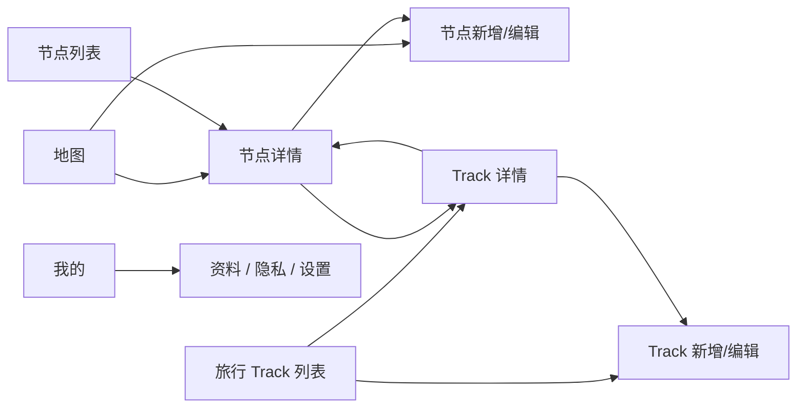

# TravelPin 前端页面设计文档（V2，基于 PDF 草图）

> 内部使用 | 版本 0.2 | 2026-04-10
>
> 本文档以 `软工ui设计.pdf` 为主要依据重写，不再以当前已实现 UI 为页面结构依据。当前代码实现仅作为技术参考，不约束本版信息架构。

## 1. 设计范围

### 1.1 本版目标

- 围绕 4 个一级业务界面重构产品结构：`地图`、`旅行 Track`、`节点`、`我的`
- 强化“地理位置记录”与“旅行路线组织”的关系，让 `Node` 和 `Track` 都成为独立入口
- 从“功能可用”升级到“页面流程完整、信息层级明确、交互逻辑闭环”

### 1.2 设计边界

- 本文档优先定义核心业务页，不展开启动页、登录页、权限引导页的视觉细节
- 独立 `Share` 页和独立 `AI Copy` 页不再作为核心一级流程；本版默认将分享能力挂在 `Track` 详情页内
- 当前 3 个 `Tab` 的结构不是最终目标结构，V2 默认升级为 4 个 `Tab`

### 1.3 术语约定

- `Node`: 单个地点记忆节点，包含地点、时间、图片、标题、正文等内容
- `Track`: 一条旅行路线或一段旅行记录，由多个 `Node` 组织而成
- `Mine`: 个人中心与设置页

---

## 2. 总体信息架构

### 2.1 一级导航

| 序号 | 一级界面 | 说明 |
|------|---------|------|
| ① | 地图 | 以地理位置为入口浏览全部 `Node` |
| ② | 旅行 `Track` | 以路线为入口浏览旅行集合与旅行详情 |
| ③ | 节点 | 按时间顺序浏览所有 `Node` |
| ④ | 我的 | 个人资料、隐私、同步、设置 |

### 2.2 核心关系

```text
地图 = 按空间浏览 Node
节点 = 按时间浏览 Node
Track = 按旅行主题组织 Node
我的 = 管理账号、隐私和设置
```

### 2.3 主流程



---

## 3. 页面清单

| 编号 | 页面名称 | 页面级别 | 说明 |
|------|---------|---------|------|
| P01 | 地图首页 | 一级 `Tab` | 地图浏览全部 `Node` 的主入口 |
| P02 | 节点详情页 | 二级页面 | 查看单个 `Node` 的完整信息 |
| P03 | 节点新增/编辑页 | 二级页面 | 新增或编辑 `Node`，新增与编辑共用 |
| P04 | 旅行 `Track` 列表页 | 一级 `Tab` | 浏览全部 `Track` |
| P05 | `Track` 详情页 | 二级页面 | 浏览单条 `Track` 的路线、节点和分享能力 |
| P06 | `Track` 新增/编辑页 | 二级页面 | 新建或编辑 `Track` |
| P07 | 节点列表页 | 一级 `Tab` | 按时间顺序浏览全部 `Node` |
| P08 | 我的 | 一级 `Tab` | 个人资料、隐私、同步、设置 |

---

## 4. 页面详细设计

### P01 地图首页（Map Home）

**定位**

- 作为产品默认首页
- 以“地点”作为第一浏览维度
- 从地图直接进入 `Node` 详情或新建 `Node`

**页面布局**

1. 顶部搜索栏
   - 占据页面上方
   - 支持按地点名称搜索
   - 视觉上保持轻量，不压缩地图面积
2. 地图主体区域
   - 展示所有 `Node` 标记点
   - 标记点是页面视觉核心
3. 底部 `TabBar`
   - 4 个入口：地图 / 旅行 / 节点 / 我的

**关键交互**

1. 点击单个地图标记点，进入 `Node` 详情页
2. 从地图空白区域发起新建 `Node`
3. 搜索地点后，地图聚焦到对应区域

**同一位置多个节点的展示方案（建议）**

PDF 中专门提出了“同一个位置有多个节点如何显示”，本版先给出推荐方案：

1. 缩放层级较远时，多个节点聚合为带数量的聚合点
2. 放大到较近层级时，同坐标点显示为“数量标记点”
3. 点击该标记点后，不直接进入详情，而是先弹出一个节点列表卡片
4. 列表卡片内显示：时间、缩略图、标题
5. 用户再从列表卡片中选择具体 `Node` 进入详情

这个方案兼顾了地图可读性和同点多节点的可选性，适合作为默认实现方向。

---

### P02 节点详情页（Node Detail）

**定位**

- 展示单个 `Node` 的完整内容
- 作为从地图、节点列表、`Track` 详情进入的统一详情页

**页面布局**

1. 顶部信息栏
   - 返回按钮
   - 地点 / 时间信息
   - 更多操作按钮
2. 图片展示区域
   - 多图轮播
   - 显示当前图片位置指示
3. 正文信息区域
   - 标题
   - 正文内容
4. 关联信息区域
   - 所属 `Track`
   - 可能存在多个 `Track` 标签

**更多操作按钮建议包含**

1. 编辑节点
2. 删除节点
3. 调整公开状态
4. 节点分享（是否保留为正式能力，见待确认项）

**关键交互**

1. 点击“编辑”进入 `Node` 新增 / 编辑页
2. 点击所属 `Track` 标签，进入对应 `Track` 详情页
3. 左右滑动图片查看多图

---

### P03 节点新增 / 编辑页（Node Edit）

**定位**

- 新增与编辑共用同一页面
- 这是内容创作主页面之一

**页面布局**

1. 顶部导航
   - 返回
   - 页面标题
   - 保存
2. 图片选择区域
   - 已选图片缩略图
   - 新增图片按钮
3. 标题输入
4. 正文输入
5. 关联 `Track` 区域
   - 以标签形式展示已关联 `Track`
   - 支持新增或删除关联
6. 元信息区域
   - 地点
   - 日期 / 时间
   - 隐私状态

**关键交互**

1. 新增时优先从地图带入地点
2. 编辑时回填所有内容
3. 保存后回到来源页面
4. 若支持多 `Track` 关联，则此页需要支持多选

**设计重点**

- 页面应比当前版本更像“创作页”，而不是简单表单
- 图片、标题、正文是主要视觉层级
- 地点、时间、隐私属于辅助信息层级

---

### P04 旅行 `Track` 列表页（Track List）

**定位**

- 以旅行为维度组织内容
- 用户进入后先看到自己拥有的全部 `Track`

**页面布局**

1. 顶部标题区
   - 页面标题 `Track`
   - 新建按钮
2. `Track` 卡片列表
   - `Track` 名称
   - 时间范围
   - 封面图或预留封面区域
   - 隐私状态图标

**关键交互**

1. 点击卡片进入 `Track` 详情页
2. 点击右上角新增按钮进入 `Track` 新增页
3. 卡片上直接可见公开 / 私密状态

**设计重点**

- 列表页要强调“每条旅行都是一个独立内容集合”
- 隐私状态必须在列表层级可见，不应只藏在详情页内

---

### P05 `Track` 详情页（Track Detail）

**定位**

- 这是本版最重要的内容浏览页之一
- 参考 `Polarsteps` 的浏览思路，但不直接照搬
- 将路线、节点、封面、分享能力集中在同一页完成

**页面布局**

1. 顶部栏
   - 返回按钮
   - `Track` 名称
   - 分享按钮
2. 路线可视化区域
   - 展示路线节点关系或简化地图
   - 当前节点高亮
3. 进度条区域
   - 支持拖动
   - 拖动后切换当前浏览节点
4. 当前节点展示卡片
   - 当前节点封面图
   - 当前节点简要信息
5. 相邻节点预览
   - 左右显示前后节点的缩略预览

**关键交互**

1. 拖动进度条切换不同节点
2. 点击当前节点进入 `Node` 详情页
3. 点击分享按钮弹出分享面板
4. 在详情页中浏览整条路线的进度与节点顺序

**分享能力建议挂载在本页**

本版默认不再把分享设计成独立一级主流程，而是在 `Track` 详情页中以内嵌面板或底部弹层完成：

1. 生成分享链接
2. 选择是否公开
3. 选择分享平台
4. 后续如需 `AI` 文案，可作为分享面板中的辅助功能，而不是单独一级页面

**设计重点**

- 这页不是“传统详情页”，而是“旅行浏览器”
- 用户应能通过一条 `Track` 快速理解旅行路线、节点顺序和代表性内容

---

### P06 `Track` 新增 / 编辑页（Track Edit）

**定位**

- 新建与编辑 `Track` 共用同一页面
- 用于配置旅行主题和组织节点

**页面布局**

1. 顶部导航
   - 返回
   - 页面标题
   - 保存
2. 标题输入
3. 节点关联区域
   - 查看已加入的节点
   - 支持新增节点到当前 `Track`
4. 公开状态开关

**关键交互**

1. 新建 `Track` 时先填写标题，再选择节点
2. 编辑 `Track` 时可以调整公开状态
3. 后续可扩展封面图、简介等字段，但不是本版必需项

**设计重点**

- 该页面要足够轻，避免把 `Track` 新建变成复杂配置流程
- 标题、节点、公开状态是本版最低可用字段

---

### P07 节点列表页（Node List）

**定位**

- 作为第三个一级内容入口
- 以时间顺序聚合所有 `Node`
- 解决“我想按时间找内容，而不是按地点找”的问题

**页面布局**

1. 顶部标题
   - 页面名：节点
2. 时间序列列表
   - 地点
   - 缩略图
   - 标题

**关键交互**

1. 默认按时间倒序罗列全部 `Node`
2. 点击某个节点进入 `Node` 详情页
3. 后续可扩展筛选，但不是本版首要目标

**设计重点**

- 该页应明显区别于 `Track` 列表
- `Track` 列表是“旅行集合”，节点列表是“时间流内容”

---

### P08 我的（Mine）

**定位**

- 作为账号、隐私、同步、设置中心
- 在 PDF 草图中尚未展开细节，因此本版先定义为轻量信息页

**建议内容模块**

1. 用户基础资料
2. 同步状态
3. 隐私设置
4. 应用设置

**设计原则**

- 不抢核心内容页的视觉权重
- 信息明确、操作直达
- 细节模块后续可单独细化

---

## 5. 全局交互规则

### 5.1 底部导航

- 全局采用 4 个 `Tab`
- `Tab` 顺序固定：地图 / 旅行 / 节点 / 我的

### 5.2 页面层级

- 一级页承载内容入口
- 二级页承载详情与编辑
- 分享、公开状态、节点选择等优先采用弹层或面板，不滥增独立页面

### 5.3 内容优先级

- `Node`: 图片、标题、正文优先
- `Track`: 路线、进度、当前节点优先
- `Mine`: 信息与设置优先

### 5.4 隐私状态

- `Track` 的公开 / 私密状态必须在列表页和编辑页都可见
- `Node` 是否需要独立公开状态，待确认后决定是否进入正式模型

---

## 6. 与当前版本的主要差异

| 项目 | 当前实现方向 | V2 设计方向 |
|------|-------------|------------|
| 一级导航 | 3 `Tab` | 4 `Tab` |
| `Node` 入口 | 主要从地图和 `Track` 进入 | 升级为独立一级入口 |
| 分享能力 | 独立页面 | 优先挂在 `Track` 详情页 |
| `AI` 文案 | 独立页面 | 优先作为分享辅助能力 |
| `Track` 详情 | 偏传统详情 + 回放 | 偏旅行浏览器，强调进度与当前节点 |
| 页面组织 | 贴近当前实现 | 贴近 PDF 草图目标结构 |

---

## 7. 待确认项

以下问题是 PDF 草图里已经暴露出来、但尚未完全定稿的地方。本版先按推荐方案写入文档，后续需要你确认：

1. 一个 `Node` 是否允许属于多个 `Track`
   - 草图中存在多个 `Track` 标签的表现
   - 如果允许多归属，数据模型需要从单一 `travelId` 升级
2. 单个 `Node` 是否支持独立分享
   - 草图在节点详情附近提到了这个可能性
   - 如果支持，需明确它与 `Track` 分享的关系
3. 同一位置多个 `Node` 的最终交互是否采用“聚合点 + 列表卡片”
   - 这是本文当前推荐方案
4. `Track` 详情页是否保留独立全屏回放页
   - PDF 更像把浏览和进度切换放在一个页内
   - 现有全屏回放页可作为增强模式保留，也可后续弱化
5. “我的”页面是否需要在这一轮就展开详细信息架构
   - PDF 中目前只给了入口，没有给出细分布局

---

## 8. 本版结论

V2 的核心不是“在现有页面上继续修补”，而是把产品重新组织成下面这条主线：

```text
地图看地点
节点看时间
Track 看旅行
我的管设置
```

因此，后续前端重构应优先围绕以下顺序展开：

1. 主框架改为 4 `Tab`
2. 补齐 `Track` 列表、详情、编辑三件套
3. 将 `Node` 提升为独立一级入口
4. 重做地图与节点详情之间的跳转和多节点聚合逻辑
5. 将分享与 `AI` 能力收敛到 `Track` 详情页附近
