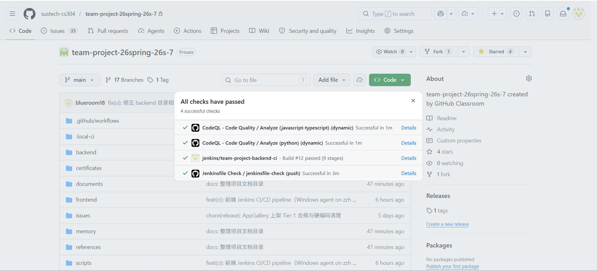
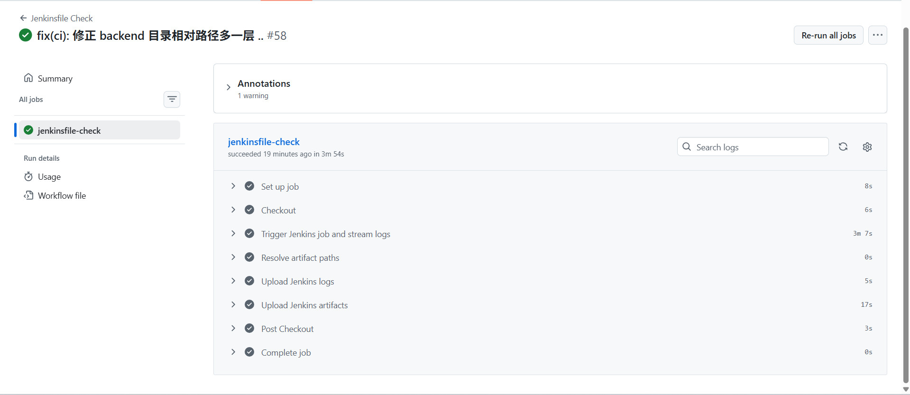
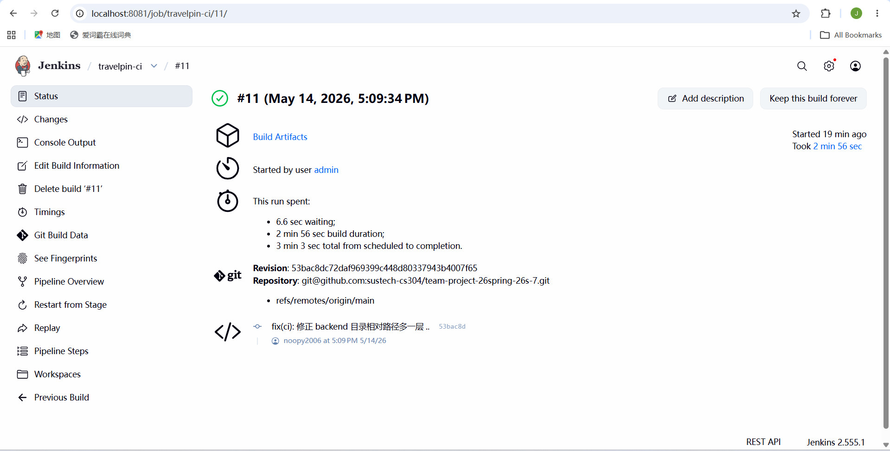
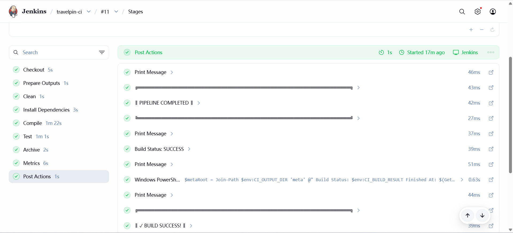
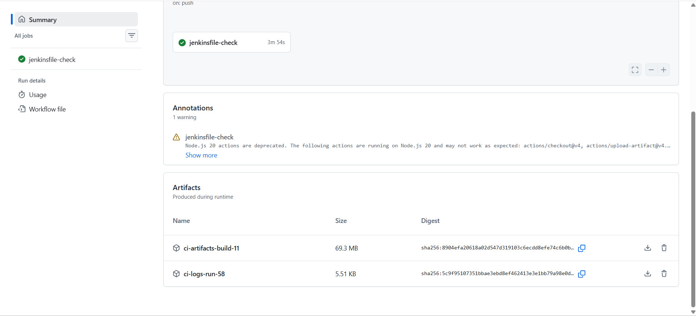
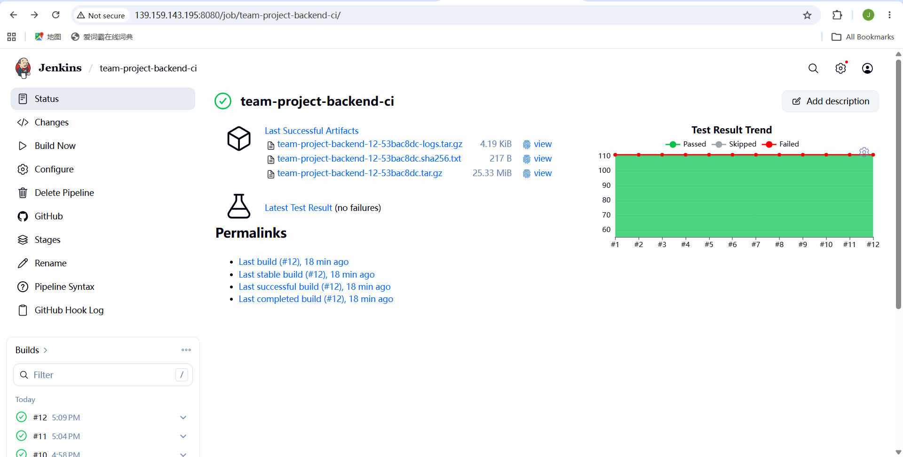
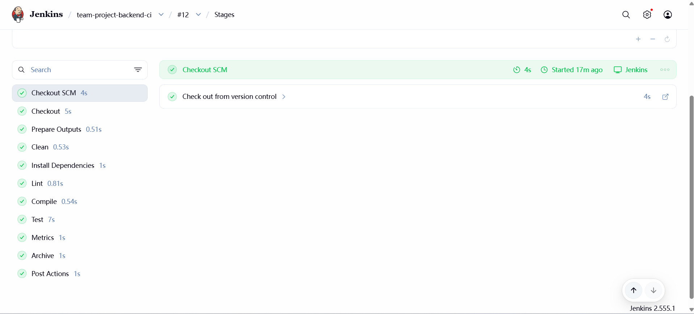

# Team Report - ItsMapPin

**Team ID**: team26s-7

**Project**: ItsMapPin - HarmonyOS travel journal app

**Date**: 2026-05-14

## 1. Metrics

We report frontend and backend metrics separately because they are implemented in
different languages and measured by different CI tools. The project-level totals
combine only directly comparable metrics: source file count, lines of code, and
direct dependency count. Cyclomatic complexity is shown per side instead of
being added together.

### 1.1 Metrics Sources

Frontend CI artifact:

- Repo-relative path: `log/ci-artifacts-frontend/metrics/summary.txt`
- CI build: frontend Jenkins build 21

Backend CI artifact:

- Repo-relative path: `backend/metrics/summary.txt`
- CI build: backend Jenkins build 27, commit `8497f59f`

### 1.2 Project Summary

| Metric | Frontend | Backend | Project Total | Notes |
|---|---:|---:|---:|---|
| Source files | 89 `.ets` | 38 `.py` | 127 | CI source-file counts |
| LOC, total lines | 27,868 | 6,705 | 34,573 | Frontend total lines + backend service lines |
| Cyclomatic complexity (total / avg) | 3,057 / 3.46 | 1,123 / 3.54 | N/A | Function-level CCN; per-side, not summed across languages |
| Direct dependencies | 6 | 11 | 17 | Frontend package manifest + backend service requirements |

### 1.3 Frontend Metrics

| Metric | Value | Source / Notes |
|---|---:|---|
| Source files | 89 | `.ets` files counted by frontend CI |
| LOC, total lines | 27,868 | `LOC (total lines)` |
| Functions detected | 883 | PowerShell brace-matched scan |
| File-level cyclomatic complexity | 2,652 total / 29.8 average per file | Regex-based file-level CCN |
| Function-level cyclomatic complexity | 3,057 total / 3.46 average per function | PowerShell per-function parser |
| Direct dependencies | 6 | 4 runtime + 2 dev dependencies |

Frontend direct dependencies:

- Runtime: `@hw-agconnect/auth`, `@hw-agconnect/auth-component`,
  `@hw-agconnect/cloud`, `@hw-agconnect/hmcore`
- Dev: `@ohos/hamock`, `@ohos/hypium`

Frontend complexity hotspots:

| CCN | File | LOC |
|---:|---|---:|
| 226 | `feature/map-travel/views/MapHomeView.ets` | 1,975 |
| 147 | `feature/map-travel/pages/TripReplayPage.ets` | 1,351 |
| 121 | `common/service/RdbDataService.ets` | 914 |
| 110 | `feature/ai-copy/pages/AiCopyPage.ets` | 1,094 |
| 107 | `common/sync/SyncManager.ets` | 550 |
| 105 | `feature/social-share/pages/SharePage.ets` | 916 |
| 99 | `common/data/MemoryNodeRepository.ets` | 664 |
| 98 | `feature/map-travel/pages/NodeDetailPage.ets` | 980 |
| 97 | `common/data/TravelRepository.ets` | 561 |
| 90 | `common/api/AiGatewayClient.ets` | 646 |

### 1.4 Backend Metrics

| Metric | Value | Source / Notes |
|---|---:|---|
| Source files | 38 | Python files across backend service targets |
| LOC, total lines | 6,705 | Backend Jenkins `loc.txt` |
| Radon CC entries | 317 | Parsed from `cyclomatic-complexity.txt` |
| Radon CC total | 1,123 | Sum of reported Radon CC entries |
| Radon CC average | 3.54 | Computed from Radon CC entries |
| Direct dependencies | 11 | Unique backend service requirements |

Backend service-level metrics:

| Service | Files | LOC | Average Radon CC |
|---|---:|---:|---|
| `ai-relay` | 1 | 611 | A, 4.86 |
| `sensitive-filter` | 1 | 300 | A, 3.85 |
| `picture-check` | 3 | 441 | A, 2.00 |
| `share-service` | 33 | 5,353 | A, 3.52 |

Backend direct dependencies:

- `fastapi`
- `httpx`
- `Pillow`
- `pydantic`
- `PyJWT`
- `pytest`
- `python-multipart`
- `qrcode`
- `requests`
- `slowapi`
- `uvicorn`

Backend complexity hotspots from Radon:

| CCN | Function | File |
|---:|---|---|
| 48 | `publish` | `share-service/share_service/routers/publish.py` |
| 23 | `chat_completions_image` | `ai-relay/siliconflow_relay.py` |
| 17 | `test_viewer_html_has_og_meta_tags` | `share-service/share_service/tests/test_publish_api.py` |
| 16 | `audit_share` | `share-service/share_service/core/audit_task.py` |
| 15 | `chat_completions` | `ai-relay/siliconflow_relay.py` |
| 15 | `_verify_token` | `share-service/share_service/core/auth.py` |
| 14 | `SensitiveWordFilter.__init__` | `sensitive-filter/sensitive_filter_service.py` |
| 13 | `find_all_hits` | `sensitive-filter/sensitive_filter_service.py` |

## 2. CI/CD Pipeline Description

ItsMapPin uses a GitHub Actions and Jenkins bridge for the frontend CI pipeline.
GitHub Actions runs on a Windows self-hosted runner, triggers the local Jenkins
job, streams Jenkins logs back into the GitHub Actions job, and uploads the
Jenkins output directory as a GitHub Actions artifact. Jenkins performs the
actual HarmonyOS build, test, package, archive, and metrics stages.

The backend runs on a separate Jenkins job at
`http://139.159.143.195:8080/job/team-project-backend-ci/`. It uses
`backend/Jenkinsfile` and executes the Python backend pipeline directly:
dependency installation, lint reporting, syntax compilation, smoke tests,
pytest, coverage generation, metrics collection, and artifact packaging.

### Frontend Pipeline Steps

| Step | What it does | Tools / Technologies |
|---|---|---|
| Checkout | Fetches the latest repository state for the CI run. | GitHub Actions `actions/checkout@v4`, Jenkins `checkout scm` |
| Trigger Jenkins | Starts the local Jenkins job and streams logs into GitHub Actions. | PowerShell, `scripts/watch-jenkins-build.ps1`, Jenkins HTTP API |
| Prepare Outputs | Creates per-build artifact folders under `ci-artifacts/build-{BUILD_NUMBER}`. | Jenkins, PowerShell |
| Clean | Cleans build caches and previous generated outputs. | Windows shell / PowerShell |
| Install Dependencies | Installs HarmonyOS frontend dependencies. | OHPM |
| Compile | Builds the HarmonyOS HAP package. | `frontend/build.ps1 --mode module -p module=entry@default assembleHap`, Hvigor |
| Test | Runs the business test suite and collects per-test results plus ETS line-level coverage data. | `frontend/build.ps1 test`, Hypium |
| Archive | Archives generated HAP packages and test/coverage reports. | Jenkins `archiveArtifacts`, GitHub Actions artifact upload |
| Metrics | Computes source file count, LOC, CCN, function count, and dependency count. | Jenkinsfile PowerShell metrics script |

**Note — Frontend Lint**: The frontend does not include a dedicated lint stage in the
pipeline. ArkTS is a HarmonyOS-specific language whose type checking and lint
infrastructure are deeply integrated into DevEco Studio (powered by the Hvigor build
system and the ArkTS compiler). Unlike mainstream languages with standalone CLI linters
(e.g., ESLint for JavaScript, Ruff for Python), ArkTS has no mature, externally
triggerable lint tool that can run independently of the DevEco IDE environment.
Therefore, ArkTS code quality checks are performed during development inside DevEco
Studio rather than as a CI stage. The frontend Compile stage does surface compiler
warnings, which are filtered and displayed in the build log.

### Backend Jenkins Pipeline Steps

| Step | What it does | Tools / Technologies |
|---|---|---|
| Checkout | Checks out the team project repository and records the short Git commit SHA. | Jenkins `checkout scm`, Git |
| Prepare Outputs | Creates the external CI artifact directory and workspace staging directory, then writes build metadata. | Jenkins, Bash, `/var/lib/jenkins/ci-artifacts/team-project-backend/build-{BUILD_NUMBER}` |
| Clean | Removes Python cache directories and previous backend build/test outputs. | Bash, `find`, `rm` |
| Install Dependencies | Creates or reuses `backend/.ci-venv`, installs CI tooling and service requirements with a hash-based dependency cache, and writes `pip-freeze.txt`. | Python venv, pip, HuaweiCloud PyPI mirror, TUNA fallback |
| Lint | Runs Ruff on `ai-relay`, `sensitive-filter`, `picture-check`, `share-service`, and `ci`; lint is warn-only and writes `reports/lint-ruff.txt`. | `ruff==0.6.9` |
| Compile | Performs Python syntax compilation for backend service and CI modules. | `python -m compileall -q` |
| Test | Runs import smoke checks for `ai-relay`, `sensitive-filter`, and `picture-check`, then runs the `share-service` pytest suite with JUnit XML and coverage reports. | `backend/ci/smoke_imports.py`, `pytest`, `pytest-cov` |
| Metrics | Counts Python files and LOC; computes Radon cyclomatic complexity, maintainability index, and raw stats; also generates documentation-level reports (`metrics/summary.txt`, `cyclomatic-complexity.txt`, `maintainability-index.txt`, `raw-stats.txt`, `loc.txt`) that serve as automated code-quality documentation for each build. | `radon cc`, `radon mi`, `radon raw`, Bash |
| Archive | Packages backend source, reports, metrics, metadata, and logs into tarballs with checksums, then archives them in Jenkins. | `tar`, `sha256sum`, Jenkins `archiveArtifacts` |

### Generated Test Reports and Documentation

Both pipelines generate structured test reports and code-quality documentation as CI
artifacts. The following table lists the key reports, their purpose, and their paths
under the `log/` directory.

**Frontend reports** (under `log/ci-artifacts-frontend/`):

| Report | Path | Purpose |
|---|---|---|
| Per-test results | `reports/coverage/coverage_data/test_result.txt` | Lists each test case name, class, and pass/fail status from Hypium. |
| Per-source coverage HTML | `reports/test/index.html` and per-package subdirectories | Line-level ETS coverage report browsable by package and file (e.g., `test/common/api/AiGatewayClient.ets.html`). |
| Coverage JSON | `reports/test/coverageReport.json` | Machine-readable line-coverage summary for the entire test suite. |
| ETS coverage data | `reports/coverage/etsCoverageData.json`, `reports/coverage/init_coverage.json` | Raw ETS line-coverage data used by the HTML report generator. |
| JS coverage data | `reports/coverage/coverage_data/js_coverage.json` | JavaScript-level coverage data collected during test execution. |
| Metrics summary | `metrics/summary.txt` | Aggregated metrics: source file count, LOC, function count, file- and function-level CCN, dependency list. |

**Backend reports** (under `log/ci-artifacts-backend/`):

| Report | Path | Purpose |
|---|---|---|
| JUnit test results | `reports/junit-share-service.xml` | JUnit XML report from pytest; consumed by Jenkins for test-result trending. |
| Coverage XML (Cobertura) | `reports/coverage-share-service.xml` | Machine-readable coverage report in Cobertura format for CI integration. |
| Coverage HTML | `reports/coverage-share-service-html/index.html` | Browsable per-file coverage report with line-level hit/miss highlighting. |
| Lint findings | `reports/lint-ruff.txt` | Ruff lint output in GitHub annotation format; warn-only, does not fail the build. |
| Cyclomatic complexity | `metrics/cyclomatic-complexity.txt` | Per-function Radon CC report ranked by complexity. |
| Maintainability index | `metrics/maintainability-index.txt` | Radon MI scores per module, indicating overall code maintainability. |
| Raw stats | `metrics/raw-stats.txt` | Radon raw metrics: LOC, lloc, sloc, comments, multi-line stats per file. |
| LOC by service | `metrics/loc.txt` | Source file count and line count broken down by backend service. |
| Metrics summary | `metrics/summary.txt` | Aggregated backend metrics with per-service breakdown and dependency list. |
| Dependency freeze | `metrics/pip-freeze.txt` | Full pip freeze snapshot for reproducibility. |

### Triggering and Feedback

- Frontend trigger: pushes to `main` and `test/ci-cd` start the GitHub Actions
  bridge, which triggers the local frontend Jenkins job `travelpin-ci`.
- Backend trigger: pushes to the team project repository are delivered to
  `http://139.159.143.195:8080/github-webhook/`; the Jenkins job
  `team-project-backend-ci` checks out the configured branch and runs
  `backend/Jenkinsfile`.
- Frontend feedback: GitHub Actions shows the bridge status and uploads Jenkins
  logs/artifacts; the frontend Jenkins job shows stage-level build status.
- Backend feedback: the backend Jenkins job shows stage-level status and posts
  the GitHub commit status context `jenkins/team-project-backend-ci`.

### Pipeline Configuration

- Frontend GitHub Actions workflow: [`.github/workflows/jenkinsfile-check.yml`](.github/workflows/jenkinsfile-check.yml)
- Frontend Jenkins pipeline: [`Jenkinsfile`](Jenkinsfile)
- Jenkins bridge script: [`scripts/watch-jenkins-build.ps1`](scripts/watch-jenkins-build.ps1)
- Backend Jenkins pipeline: [`backend/Jenkinsfile`](backend/Jenkinsfile)

### Successful Execution Evidence

The following screenshot shows one commit receiving both frontend and backend CI
checks. GitHub displays each check with a status icon, so contributors can see
success or failure feedback directly on the commit.

Frontend proof:

- GitHub Actions run URL:
  <https://github.com/sustech-cs304/team-project-26spring-26s-7/actions/runs/25851795537/job/75959874734>
- Packaged HAP artifacts:
  - `log/ci-artifacts-frontend/packages/entry-default-signed.hap`
  - `log/ci-artifacts-frontend/packages/entry-default-unsigned.hap`
- Packaged Logs:
  - `log\ci-artifacts-frontend\logs`

Backend proof:

- Backend Jenkins URL:
  <http://139.159.143.195:8080/job/team-project-backend-ci/>
- Packaged Logs:
  - `log\ci-artifacts-backend\logs`

