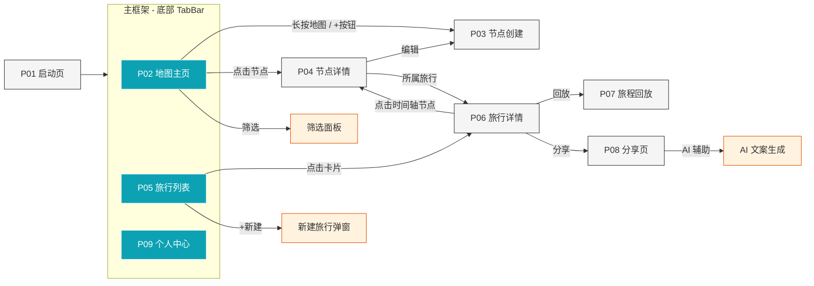

# TravelPin 前端页面设计文档

> 内部使用 | 版本 0.1 | 2026-03-20

## 1. 页面总览

| 编号 | 页面名称 | 路径 | 说明 |
|------|---------|------|------|
| P01 | 启动页 | `pages/Index` | 品牌展示 + 数据初始化 + 自动跳转 |
| P-L | 登录页 | `pages/LoginPage` | 华为账号一键登录 |
| P02 | 地图主页 | `pages/MainPage` (Tab 1) | 底部 Tab 首页，核心地图交互 |
| P03 | 节点创建/编辑页 | `pages/NodeEditPage` | 创建或编辑单个记忆节点 |
| P04 | 节点详情页 | `pages/NodeDetailPage` | 查看记忆节点完整内容 |
| P05 | 旅行列表页 | `pages/MainPage` (Tab 2) | 底部 Tab 第二页，所有旅行路线列表 |
| P06 | 旅行详情页 | `pages/TripDetailPage` | 单条旅行的路线地图 + 节点时间轴 |
| P07 | 旅程回放页 | `pages/TripReplayPage` | 全屏动画回放旅行轨迹 |
| P08 | 分享页 | `pages/SharePage` | 生成链接 + AI 文案 + 平台选择 |
| P09 | 个人中心页 | `pages/MainPage` (Tab 3) | 设置与同步状态 |

---

## 2. 导航结构

```
App 启动
  └─ P01 启动页
       └─ 主框架 (底部 TabBar: 地图 / 旅行 / 我的)
            ├─ Tab 1: P02 地图主页
            │    ├─ 点击地图空白处 ──→ P03 节点创建页
            │    ├─ 点击已有节点 ──→ P04 节点详情页
            │    │    └─ 点击「编辑」──→ P03 节点编辑页
            │    └─ 点击「筛选」──→ 筛选面板 (半屏弹出)
            │
            ├─ Tab 2: P05 旅行列表页
            │    ├─ 点击旅行卡片 ──→ P06 旅行详情页
            │    │    ├─ 点击「回放」──→ P07 旅程回放页
            │    │    ├─ 点击「分享」──→ P08 分享页
            │    │    └─ 点击时间轴节点 ──→ P04 节点详情页
            │    └─ 点击「+」──→ 新建旅行 (弹窗)
            │
            └─ Tab 3: P09 个人中心页
                 ├─ 同步状态卡片
                 ├─ 隐私与安全设置
                 └─ 关于 / 退出登录
```

---

## 3. 各页面详细设计

### P01 启动页 (Splash)

**用途**：品牌展示，同时完成本地数据库初始化和登录态检查。

**布局**：
```
┌─────────────────────────┐
│                         │
│                         │
│       [App Logo]        │
│       TravelPin         │
│                         │
│      · · · 加载中       │
│                         │
└─────────────────────────┘
```

**交互逻辑**：
- 停留 1.5~2 秒后自动跳转至主框架 (P02)
- 首次安装时，跳转前插入权限引导（定位权限申请）

---

### P02 地图主页 (MapHome)

**用途**：核心页面。展示全部记忆节点，支持缩放、聚合、筛选。

**布局**：
```
┌─────────────────────────┐
│ [搜索栏]        [筛选]  │
├─────────────────────────┤
│                         │
│      ┌──┐               │
│      │聚合│    📍        │
│      │ 12│       📍     │
│      └──┘               │
│            📍           │
│                         │
│                  [定位]  │
│              [+ 新节点]  │
├─────────────────────────┤
│  🗺 地图  |  📋 旅行  |  👤 我的  │
└─────────────────────────┘
```

**组件说明**：
| 组件 | 说明 |
|------|------|
| 搜索栏 | 按 POI 名称、标签关键字搜索节点 |
| 筛选按钮 | 弹出半屏面板：按时间范围、标签、心情筛选 |
| 地图区域 | 全屏地图，展示记忆节点（聚合/展开） |
| 定位按钮 | 飞回当前 GPS 位置 |
| + 新节点 | 在当前定位或长按选点处创建节点 |
| 底部 TabBar | 三 Tab 导航，始终可见 |

**交互逻辑**：
- 地图缩放时，密集节点自动聚合为带数字的气泡；点击聚合气泡放大展开
- 点击单个节点 Pin → 弹出底部预览卡片（缩略图 + 标题 + 日期），上滑或点击进入 P04
- 长按地图空白 → 弹出确认气泡「在此添加记忆？」→ 跳转 P03

---

### P03 节点创建/编辑页 (NodeEdit)

**用途**：创建新节点或编辑已有节点。

**布局**：
```
┌─────────────────────────┐
│ ← 返回        保存 [✓] │
├─────────────────────────┤
│ 📍 位置: 南方科技大学     │
│    纬度 22.59  经度 113.97│
├─────────────────────────┤
│ ┌─────┐ ┌─────┐ [+ 照片]│
│ │ img │ │ img │         │
│ └─────┘ └─────┘         │
├─────────────────────────┤
│ 标题: [输入框]           │
├─────────────────────────┤
│ 内容:                    │
│ [多行文本输入框]          │
│                         │
├─────────────────────────┤
│ 心情: 😊 😢 🤩 😌 [更多] │
├─────────────────────────┤
│ 标签: [旅行] [美食] [+]  │
├─────────────────────────┤
│ 所属旅行: [下拉选择/无]   │
└─────────────────────────┘
```

**交互逻辑**：
- 位置默认取当前 GPS，支持点击切换到地图选点
- 点击「+ 照片」调用系统 Photo Picker（最小权限）
- 照片选入后立即本地剥离 EXIF 元数据
- 「所属旅行」可关联到已有旅行，或暂不关联
- 保存时数据写入本地 RDB，排入同步队列

---

### P04 节点详情页 (NodeDetail)

**用途**：只读查看单个记忆节点的完整信息。

**布局**：
```
┌─────────────────────────┐
│ ← 返回     [编辑] [删除]│
├─────────────────────────┤
│ ┌─────────────────────┐ │
│ │                     │ │
│ │   照片轮播 (Swiper)  │ │
│ │                     │ │
│ └─────────────────────┘ │
│   · · ·   (指示器)      │
├─────────────────────────┤
│ 节点标题                 │
│ 📍 南方科技大学 · 2026.03│
│ 😊 心情 · #旅行 #打卡   │
├─────────────────────────┤
│                         │
│ 正文内容...              │
│                         │
├─────────────────────────┤
│ 所属旅行: 深圳三日游  →  │
└─────────────────────────┘
```

**交互逻辑**：
- 照片区域支持左右滑动轮播，点击可全屏预览
- 点击「编辑」→ 跳转 P03（带回填数据）
- 点击「删除」→ 二次确认弹窗，确认后级联删除本地 + 同步队列
- 点击「所属旅行」→ 跳转 P06

---

### P05 旅行列表页 (TripList)

**用途**：展示所有旅行路线，按时间倒序排列。

**布局**：
```
┌─────────────────────────┐
│  我的旅行          [+ 新建]│
├─────────────────────────┤
│ ┌─────────────────────┐ │
│ │ 🖼 封面图            │ │
│ │ 深圳三日游           │ │
│ │ 2026.03.15 ~ 03.17  │ │
│ │ 📍 5个节点 · 128km   │ │
│ └─────────────────────┘ │
│ ┌─────────────────────┐ │
│ │ 🖼 封面图            │ │
│ │ 广州周末             │ │
│ │ 2026.03.01 ~ 03.02  │ │
│ │ 📍 3个节点 · 45km    │ │
│ └─────────────────────┘ │
│         ...             │
├─────────────────────────┤
│  🗺 地图  |  📋 旅行  |  👤 我的  │
└─────────────────────────┘
```

**交互逻辑**：
- 点击旅行卡片 → 跳转 P06
- 「+ 新建」→ 弹出对话框，输入旅行名称和日期范围，创建空旅行
- 支持左滑卡片露出「删除」按钮

---

### P06 旅行详情页 (TripDetail)

**用途**：查看单条旅行的完整路线地图和节点时间轴。

**布局**：
```
┌─────────────────────────┐
│ ← 返回  深圳三日游  [···]│
├─────────────────────────┤
│                         │
│   ╭─📍──📍──📍─╮       │
│   │   路线地图   │       │
│   ╰─────────────╯       │
│                         │
│  [▶ 回放]    [↗ 分享]   │
├─────────────────────────┤
│ 📊 共 5 节点 · 128km    │
│     2026.03.15 ~ 03.17  │
├─── 时间轴 ──────────────┤
│ ● 03.15  深圳湾公园      │
│ │  📷 3张 · "海边日落..." │
│ ● 03.16  世界之窗        │
│ │  📷 5张 · "微缩世界..." │
│ ● 03.17  南方科技大学     │
│    📷 2张 · "校园春色..." │
└─────────────────────────┘
```

**组件说明**：
| 组件 | 说明 |
|------|------|
| 路线地图 | 小地图展示完整轨迹折线 + 各节点标记 |
| 回放按钮 | 跳转 P07 全屏动画回放 |
| 分享按钮 | 跳转 P08 分享流程 |
| 统计栏 | 节点数、总里程、日期范围 |
| 时间轴 | 按时间排序展示各节点摘要，点击进入 P04 |

**交互逻辑**：
- 右上角「···」菜单：编辑旅行信息 / 添加已有节点到旅行 / 删除旅行
- 点击时间轴上任意节点 → 跳转 P04
- 点击地图上的 Pin → 地图高亮 + 时间轴自动滚动到对应节点

---

### P07 旅程回放页 (TripReplay)

**用途**：全屏沉浸式动画回放旅行轨迹。

**布局**：
```
┌─────────────────────────┐
│ [✕ 退出]                │
│                         │
│                         │
│     ╭──📍─────╮         │
│     │ 地图动画  │        │
│     │ 镜头跟随  │        │
│     ╰──────📍─╯         │
│                         │
│ ┌─────────────────────┐ │
│ │ 📷 当前节点照片       │ │
│ │ "海边的日落真美..."    │ │
│ └─────────────────────┘ │
├─────────────────────────┤
│ ◄◄  ▶/⏸  ►► │──●───│   │
│ 03.15        速度 [1x▾] │
└─────────────────────────┘
```

**交互逻辑**：
- 地图镜头沿轨迹自动平移，经过节点时暂停并弹出该节点的照片和文字
- 底部控制栏：播放/暂停、上一节点/下一节点、进度条拖动、倍速切换 (0.5x / 1x / 2x)
- 点击退出 → 返回 P06
- 横屏支持（可选）

---

### P08 分享页 (Share)

**用途**：生成分享链接 + AI 文案辅助 + 选择分享平台。一站式完成分享流程。

**布局**：
```
┌─────────────────────────┐
│ ← 返回     分享旅行      │
├─────────────────────────┤
│ 🔗 分享链接              │
│ ┌─────────────────────┐ │
│ │ https://tp.app/s/xK │ │
│ │ 有效期: 7天     [复制]│ │
│ └─────────────────────┘ │
├─────────────────────────┤
│ ✏️ 分享文案              │
│ ┌─────────────────────┐ │
│ │ [文案编辑区]          │ │
│ │                     │ │
│ └─────────────────────┘ │
│                         │
│ 🤖 AI 辅助   风格: [诗意▾]│
│ ┌─────────────────────┐ │
│ │ 「三月的深圳，海风带着  │ │
│ │  盐味和花香，128公里的  │ │
│ │  足迹串起五处记忆...」  │ │
│ │         [采用此文案 ↑] │ │
│ │         [换一批 ↻]    │ │
│ └─────────────────────┘ │
├─────────────────────────┤
│ 分享到:                  │
│ [微信] [微博] [复制链接]  │
└─────────────────────────┘
```

**交互逻辑**：
- 进入页面自动生成签名链接（HMAC-SHA256 + TTL）
- 文案编辑区：用户可手动编写，也可使用 AI 生成结果
- AI 辅助区域：
  - 风格下拉选择：诗意 / 探险 / 简洁 / 幽默
  - 点击「换一批」重新请求 LLM（基于旅程元数据：POI 列表、距离、时长）
  - 点击「采用此文案」将 AI 文案填入编辑区
  - 不发送任何照片到云端 LLM，仅发送文本元数据
- 底部分享按钮：调用系统分享能力跳转对应平台

---

### P09 个人中心页 (Profile)

**用途**：用户设置、同步状态、隐私管理。

**布局**：
```
┌─────────────────────────┐
│  个人中心                │
├─────────────────────────┤
│  👤 用户名               │
│  设备: MatePad Pro       │
├─────────────────────────┤
│ ☁️ 同步状态               │
│  ┌─────────────────────┐│
│  │ 上次同步: 2分钟前     ││
│  │ 待同步: 3项           ││
│  │ [立即同步]            ││
│  └─────────────────────┘│
├─────────────────────────┤
│ ⚙️ 设置                  │
│  > 隐私与安全            │
│  > 流量与存储            │
│  > 分享链接默认有效期     │
│  > 关于 TravelPin        │
├─────────────────────────┤
│  🗺 地图  |  📋 旅行  |  👤 我的  │
└─────────────────────────┘
```

**设置子项说明**：
| 设置项 | 内容 |
|--------|------|
| 隐私与安全 | EXIF 剥离开关（默认开且推荐保持）、AI 内容审核提示 |
| 流量与存储 | 仅 Wi-Fi 同步开关、本地缓存清理、图片质量偏好 |
| 分享链接默认有效期 | 1天 / 7天 / 30天 |

---

## 4. 页面跳转关系图



---

## 5. 全局组件

以下组件在多个页面中复用：

| 组件 | 使用页面 | 说明 |
|------|---------|------|
| `BottomTabBar` | P02, P05, P09 | 三 Tab 导航栏 |
| `NodePreviewCard` | P02 (底部弹出), P06 (时间轴) | 节点缩略信息卡片 |
| `MapView` | P02, P06, P07 | 封装地图渲染、聚合、轨迹绘制 |
| `PhotoPicker` | P03 | 调用系统 Photo Picker + EXIF 剥离 |
| `SyncStatusBadge` | P09, TabBar | 同步状态指示器 |
| `ConfirmDialog` | 全局 | 删除等危险操作的二次确认弹窗 |
| `LoadingOverlay` | 全局 | AI 生成、同步等异步操作的加载状态 |

---

## 6. 数据流概要

```
用户操作
  │
  ▼
页面 ViewModel (状态管理)
  │
  ├──读/写──→ 本地 RDB (记忆节点、旅行、用户设置)
  │
  ├──读/写──→ 本地文件系统 (照片、缓存)
  │
  ├──异步───→ SyncManager ──→ 云端同步服务器
  │
  └──请求───→ AI Gateway (文案生成，仅文本元数据)
```

**离线策略**：所有写操作优先落本地 RDB，SyncManager 在网络可用时后台批量推送。页面通过监听 RDB 变更刷新 UI，不依赖网络状态。
