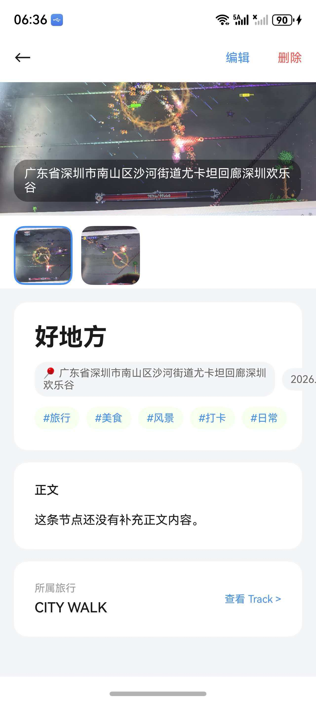
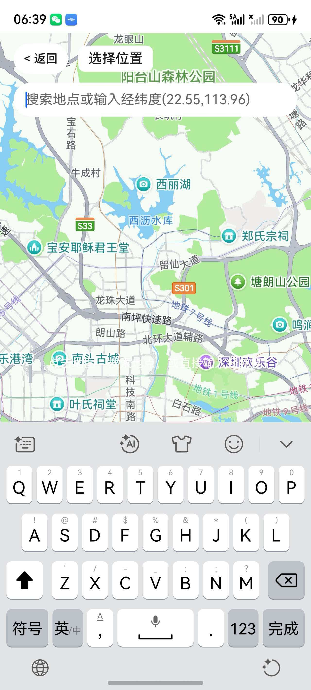
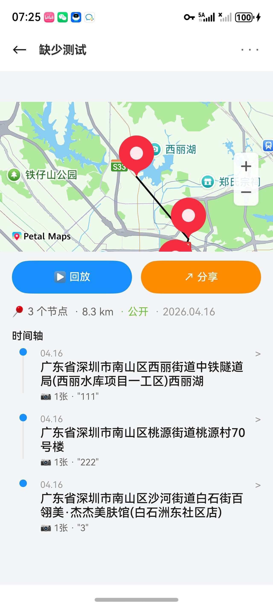
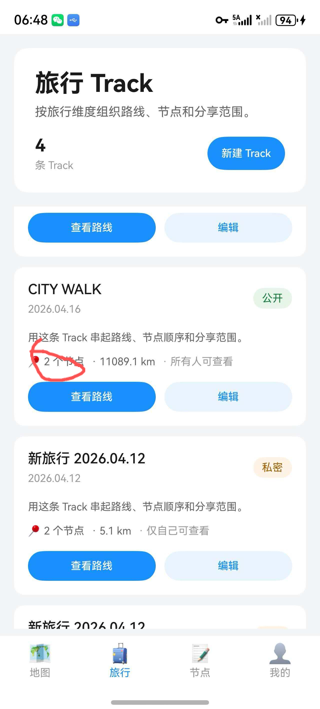

# Sprint 1 Fix Issues 清单

**创建日期**: 2026-04-16  
**里程碑**: 中期验收 (Sprint 1)  
**分支**: `sprint1`

---

## Issues 总览

| ID | 标题 | 类型 | 模块 | 优先级 | 状态 |
|----|------|------|------|--------|------|
| #1 | 旅游展示页面日期标签溢出屏幕边界 | UI | map-travel | 🟡 P1 | ⏳ Open |
| #2 | 搜索框提示文本与实际功能不符 | UI | map-travel | 🟢 P2 | ⏳ Open |
| #3 | 云端数据库字段长度限制可能导致存储失败 | Database | cloud-sync | 🟡 P1 | ⏳ Open |
| #4 | 下载云端节点后封面节点总数不更新 | Sync | cloud-sync | 🟡 P1 | ⏳ Open |
| #5 | 删除路线时节点数据未正确处理 | Logic | map-travel | 🔴 P0 | ⏳ Open |
| #6 | 表情选择后无法取消选择 | UI | map-travel | 🟢 P2 | ⏳ Open |
| #7 | 节点封面显示内容不统一且缺少截断处理 | UI | map-travel | 🟡 P1 | ⏳ Open |
| #8 | 编辑节点上传照片后展示页不刷新 | Sync | map-travel | 🟢 P2 | ⏳ Open |
| #9 | 正文输入框缺少字数计数器 | UI | map-travel | 🟢 P2 | ⏳ Open |

**优先级说明**:
- 🔴 P0: 最高优先级 - 数据一致性/核心功能问题
- 🟡 P1: 中等优先级 - UI 缺陷/用户体验问题
- 🟢 P2: 低优先级 - 优化/文案调整

---

## Issue #1: 旅游展示页面日期标签溢出屏幕边界

**优先级**: 🟡 P1

### 问题描述
旅游展示页面（TripListView）中，节点的日期标签延伸到屏幕之外，超出可视区域。同时需要考虑如果在此处增加更多标签，可能还会出现溢出问题。

### 配图

> 图示：节点详情页显示 5 个标签（#旅行 #美食 #风景 #打卡 #日常），需要确保在列表页等狭小空间中不会溢出。

### 复现步骤
1. 打开旅行路线纵览页面 (`TripListView.ets`)
2. 查看单个旅行卡片的日期标签
3. 观察标签是否延伸到屏幕右侧边界外

### 期望行为
- 日期标签完全显示在屏幕边界内
- 增加更多标签时，自动换行或截断，不会溢出

### 环境
- DevEco Studio: 4.0+
- 设备：模拟器/真机

### 涉及文件
- `frontend/entry/src/main/ets/feature/map-travel/views/TripListView.ets`
- `frontend/entry/src/main/ets/common/utils/Constants.ets` (样式常量)

### 修改建议
1. 检查日期标签的 `width` 约束，使用 `layoutWeight` 或固定宽度
2. 添加 `TextOverflow.Ellipsis` 处理长文本
3. 使用 `Flex` 布局的 `wrap` 属性支持多行显示
4. 考虑增加水平滚动容器作为备选方案

### 验收标准
- [ ] 日期标签在任何屏幕尺寸下不溢出边界
- [ ] 添加 3 个以上标签时仍能正常显示（换行或滚动）
- [ ] 长日期文本正确截断并显示省略号

### 关联 Issue
无

---

## Issue #2: 搜索框提示文本与实际功能不符

**优先级**: 🟢 P2

### 问题描述
地图首页搜索框中的占位提示文本包含"或输入经纬度 (22.5, 113.96)"，但实际功能并未实现经纬度输入定位，误导用户。

### 配图

> 图示：搜索框提示文本显示"搜索地点或输入经纬度 (22.55, 113.96)"，但实际不支持经纬度输入定位功能。

### 复现步骤
1. 打开地图首页 (`MapHomeView.ets`)
2. 点击搜索框，查看空白时的提示文本
3. 尝试输入经纬度坐标，观察是否有任何反应

### 期望行为
- 提示文本仅显示实际支持的功能
- 移除"或输入经纬度"相关提示

### 环境
- DevEco Studio: 4.0+
- 设备：模拟器/真机

### 涉及文件
- `frontend/entry/src/main/ets/feature/map-travel/views/MapHomeView.ets`

### 修改建议
1. 定位搜索框 `TextInput` 组件的 `placeholder` 属性
2. 将提示文本从类似 `"搜索地点、标签... 或输入经纬度 (22.5, 113.96)"` 修改为 `"搜索地点、标签..."`

### 验收标准
- [ ] 搜索框提示文本不包含经纬度相关说明
- [ ] 提示文本简洁清晰

### 关联 Issue
无

---

## Issue #3: 云端数据库字段长度限制可能导致存储失败

**优先级**: 🟡 P1

### 问题描述
云端数据库中，正文内容和图片路径字段使用 `String` 类型，可能存在字数上限。当用户上传长文本内容或多张图片时，可能超出限制导致存储失败。

### 复现步骤
1. 创建节点并输入超过 1000 字的正文内容
2. 上传多张图片（如 10 张以上）
3. 尝试保存到云端
4. 观察是否出现存储错误或数据截断

### 期望行为
- 正文字段支持更长内容（建议 2000+ 字）
- 图片路径字段支持存储多张图片路径
- 超出限制时给出友好提示而非静默失败

### 环境
- DevEco Studio: 4.0+
- 云端：华为云存储 OSS

### 涉及文件
- `frontend/entry/src/main/ets/common/sync/CloudMemoryNode.ets`
- `frontend/entry/src/main/ets/common/service/types.ets` (数据模型定义)
- 后端数据库 Schema 定义文件

### 修改建议
1. 前端：检查 `types.ets` 中 `MemoryNode` 的 `content` 和 `photos` 字段类型
2. 后端：将数据库字段类型从 `VARCHAR`/`String` 改为 `TEXT`
3. 前端：在输入框增加字数上限提示（见 Issue #9）

### 验收标准
- [ ] 正文字段支持至少 2000 字
- [ ] 图片路径字段支持存储至少 20 张图片
- [ ] 超出限制时有明确的错误提示

### 关联 Issue
- related to #9 (字数上限提示)

---

## Issue #4: 下载云端节点后封面节点总数不更新

**优先级**: 🟡 P1

### 问题描述
从云端下载节点数据后，旅行路线纵览页面（`TripListView`）中单个旅行的封面显示的节点总数仍是旧值，需要手动刷新才能看到最新数量。另外，本地删除节点后退出到旅行路线纵览页面也会出现同样的问题。

### 配图

> 图示：红圈标注位置显示"2 个节点"，但实际数据可能已变化。下载云端节点或删除本地节点后，该数字未同步更新。

### 复现步骤
**场景 A - 云端下载**:
1. 在云端有多个节点
2. 在本地点击下载/同步按钮
3. 观察旅行纵览页面的节点计数

**场景 B - 本地删除**:
1. 在节点详情页删除一个节点
2. 返回旅行路线纵览页面
3. 观察节点计数是否减少

### 期望行为
- 下载云端节点后，节点计数立即更新
- 本地删除节点后，计数立即同步更新

### 环境
- DevEco Studio: 4.0+
- 设备：模拟器/真机

### 涉及文件
- `frontend/entry/src/main/ets/feature/map-travel/views/TripListView.ets`
- `frontend/entry/src/main/ets/common/sync/SyncManager.ets`
- `frontend/entry/src/main/ets/common/data/TravelRepository.ets`

### 修改建议
1. 在 `SyncManager` 同步完成后，触发 `travelDataVersion` 更新
2. 在 `TripListView` 中使用 `@StorageLink('travelDataVersion')` 监听数据变化
3. 本地删除节点后，确保调用相同的数据更新机制
4. 考虑使用事件总线或回调通知上层页面

### 验收标准
- [ ] 云端下载完成后，节点计数在 1 秒内更新
- [ ] 本地删除节点后，计数立即更新
- [ ] 无需手动刷新页面

### 关联 Issue
无

---

## Issue #5: 删除路线时节点数据未正确处理

**优先级**: 🔴 P0 (最高优先级)

### 问题描述
当前删除旅行路线时，关联的节点没有被正确处理。期望行为是将节点的"所属路线"字段置为"空置"（null）并同步到云端，而不是让节点随路线一起消失或保持关联已删除的路线。

### 复现步骤
1. 创建一个包含多个节点的旅行路线
2. 删除该旅行路线
3. 检查节点的归属状态
4. 观察节点是否仍关联已删除的路线

### 期望行为
- 删除路线后，关联节点的 `travelId` 字段置为 `null` 或空置
- 节点数据本身保留，可在"未分类"或"孤节点"列表中查看
- 变更同步到云端数据库

### 环境
- DevEco Studio: 4.0+
- 云端：华为云存储 + 自建服务器

### 涉及文件
- `frontend/entry/src/main/ets/common/service/RdbDataService.ets`
- `frontend/entry/src/main/ets/common/data/TravelRepository.ets`
- `frontend/entry/src/main/ets/common/data/MemoryNodeRepository.ets`
- `frontend/entry/src/main/ets/common/sync/CloudSyncService.ets`

### 修改建议
1. 在 `deleteTravel()` 方法中，先查询关联的所有节点
2. 遍历节点，调用 `updateNode()` 将 `travelId` 置为 `null`
3. 触发同步机制，将变更上传到云端
4. 考虑在 UI 层提供"删除路线及其节点"和"仅删除路线"两种选项

### 验收标准
- [ ] 删除路线后，关联节点的 `travelId` 为 `null`
- [ ] 节点数据可在"未分类"列表中查看
- [ ] 变更同步到云端

### 关联 Issue
无

---

## Issue #6: 表情选择后无法取消选择

**优先级**: 🟢 P2

### 问题描述
在节点编辑页面选择表情（mood）后，无法取消选择或重置为"无表情"状态，用户必须选择其中一个表情。

### 复现步骤
1. 打开节点编辑页面 (`NodeEditPage.ets`)
2. 点击表情选择器
3. 选择一个表情
4. 尝试取消选择

### 期望行为
- 提供明确的"取消"或"清空"按钮

### 环境
- DevEco Studio: 4.0+
- 设备：模拟器/真机

### 涉及文件
- `frontend/entry/src/main/ets/feature/map-travel/pages/NodeEditPage.ets`
- 表情选择器组件（如有独立组件）

### 修改建议
1. 或在已选表情上再次点击可取消选择

### 验收标准
- [ ] 取消选择操作直观易懂

### 关联 Issue
无

---

## Issue #7: 节点封面显示内容不统一且缺少截断处理

**优先级**: 🟡 P1

### 问题描述
在旅行路线的单个路线节点展示页面，节点封面有时显示节点标题，有时显示正文内容，显示逻辑不统一。同时，长标题会溢出边界，缺少省略号截断处理。

### 配图

> 图示：旅行详情页的节点列表中，每个节点的封面卡片应统一显示标题，但实际显示内容不一致。长标题也需要省略号截断。

### 复现步骤
1. 打开旅行详情页面 (`TripDetailPage.ets`)
2. 查看节点列表中的封面卡片
3. 观察不同节点的封面显示内容（标题/正文）
4. 尝试创建长标题节点（如超过 30 字）

### 期望行为
- 所有节点封面统一显示标题
- 长标题自动截断并显示省略号
- 标题长度限制合理（如最多显示 20 字）

### 环境
- DevEco Studio: 4.0+
- 设备：模拟器/真机

### 涉及文件
- `frontend/entry/src/main/ets/feature/map-travel/views/NodeListView.ets`
- `frontend/entry/src/main/ets/feature/map-travel/components/` (如有封面组件)

### 修改建议
1. 统一封面显示逻辑，固定显示 `node.title`
2. 设置合理的宽度约束防止溢出

### 验收标准
- [ ] 所有节点封面显示标题而非正文
- [ ] 超过 20 字的标题显示省略号
- [ ] 标题不溢出卡片边界

### 关联 Issue
无

---

## Issue #8: 编辑节点上传照片后展示页不刷新

**优先级**: 🟢 P2 (最低优先级)

### 问题描述
当一个节点原本没有照片，通过"编辑节点"功能上传照片后，返回节点展示页面时照片不会立即显示，需要退出页面重新进入才能看到新上传的照片。

### 复现步骤
1. 打开一个没有照片的节点详情页
2. 点击"编辑"按钮
3. 上传一张或多张照片
4. 保存并返回节点详情页
5. 观察照片是否立即显示

### 期望行为
- 上传照片保存后，展示页立即刷新显示新照片
- 无需手动退出重进

### 环境
- DevEco Studio: 4.0+
- 设备：模拟器/真机

### 涉及文件
- `frontend/entry/src/main/ets/feature/map-travel/pages/NodeEditPage.ets`
- `frontend/entry/src/main/ets/feature/map-travel/pages/NodeDetailPage.ets`
- `frontend/entry/src/main/ets/common/service/RdbDataService.ets`

### 修改建议
1. 在 `NodeEditPage` 保存成功后，触发数据更新事件
2. 在 `NodeDetailPage` 使用 `@StorageLink('travelDataVersion')` 或 `@State` 监听数据变化
3. 或使用 `EventHub` 实现页面间通信
4. 或在 `onPageShow()` 中重新加载节点数据

### 验收标准
- [ ] 上传照片后，返回详情页立即显示
- [ ] 无需手动刷新或重新进入

### 关联 Issue
无

---

## Issue #9: 正文输入框缺少字数计数器

**优先级**: 🟢 P2

### 问题描述
节点编辑页面的正文输入框没有显示当前字数和上限提示，用户无法直观了解已输入字数和剩余字数，可能导致超出数据库限制（见 Issue #3）。

### 复现步骤
1. 打开节点编辑页面 (`NodeEditPage.ets`)
2. 找到正文内容输入框
3. 观察是否有字数计数显示（如"0/1000 字"）

### 期望行为
- 输入框下方或右下角显示"当前字数/上限字数"
- 接近上限时有视觉提醒（如变色）
- 超出上限时禁止继续输入

### 环境
- DevEco Studio: 4.0+
- 设备：模拟器/真机

### 涉及文件
- `frontend/entry/src/main/ets/feature/map-travel/pages/NodeEditPage.ets`
- `frontend/entry/src/main/ets/common/utils/Constants.ets` (字数上限常量)

### 修改建议
1. 在正文输入框下方添加 `Text` 组件显示字数
2. 使用 `TextArea` 的 `onChange` 事件监听输入
3. 设置 `maxLength` 属性限制输入长度
4. 接近上限时（如 90%）改变计数颜色

### 验收标准
- [ ] 输入框显示"X/1000 字"格式计数
- [ ] 达到上限时无法继续输入
- [ ] 接近上限时有视觉提醒

### 关联 Issue
- related to #3 (数据库字段长度限制)

---

## 附录：模块与文件映射

| 模块 | 涉及文件 |
|------|---------|
| **map-travel** | `TripListView.ets`, `MapHomeView.ets`, `NodeEditPage.ets`, `NodeDetailPage.ets`, `NodeListView.ets`, `TripDetailPage.ets` |
| **cloud-sync** | `CloudMemoryNode.ets`, `CloudSyncService.ets`, `SyncManager.ets`, `CloudTravel.ets` |
| **data** | `RdbDataService.ets`, `TravelRepository.ets`, `MemoryNodeRepository.ets`, `RdbHelper.ets` |
| **common** | `types.ets`, `Constants.ets`, `Logger.ets` |

---

## 配图说明

| 图片 | 对应 Issue | 说明 |
|------|-----------|------|
| `1.jpg` | #1 | 节点详情页显示 5 个标签 |
| `2.jpg` | #2 | 搜索框提示文本包含经纬度 |
| `3.png` | #7 | 旅行详情页节点列表 |
| `7.jpg` | #4 | 旅行纵览页节点数显示 |

---

## 下一步操作

1. ✅ 确认本清单内容无误
2. ⏭️ 使用 `gh issue create` 发布到 GitHub
3. ⏭️ 分配负责人并开始修复
