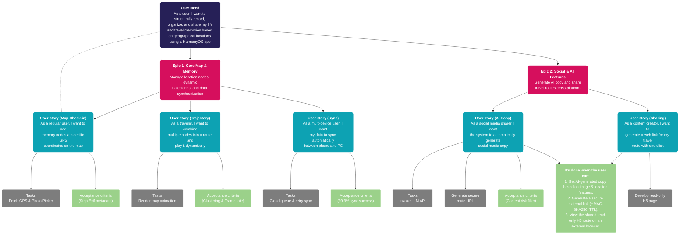

# Project Proposal: HarmonyOS Location-Based Travel Journal App

## Part I. Preliminary Requirement Analysis

This system utilizes an offline-first, three-tier architecture (Client, Local Backend, Cloud) to deliver a seamless and secure location-based journaling experience. 

### 1. Functional Requirements

The proposed system includes the following 5 distinct and orthogonal features:

* **Interactive Spatiotemporal Map:** Users can pin photos, stories, and moods to their exact geographical coordinates. This feature transforms a blank world map into a personalized, location-based immersive life journal, making every check-in visually anchored to a real-world location.
* **Dynamic Journey Replay:** Users can select and group specific memory nodes to archive a trip. The system intelligently parses these nodes to render a continuous travel trajectory. By clicking play, users can immersively replay their journey through cinematic, dynamic map animations.
* **Cross-Platform Route Sharing:** With a single click, users can generate a beautifully formatted, dedicated web link for their travel route and share it seamlessly to social platforms like WeChat and Weibo. Friends can view the complete journey and interact via comments directly on a web browser without installing the app.
* **AI-Powered Social Media Copywriting:** By selecting photos and check-in locations, users can trigger the built-in AI assistant. The AI analyzes the visual aesthetics of the images and the geographical features of the location to instantly generate multiple sets of engaging, style-varied captions tailored for social media posting.
* **Multi-Device Seamless Synchronization:** Map nodes, travel routes, and drafts automatically sync in real-time across mobile phones, tablets, and web browsers. Users can record moments on the go via the mobile app and seamlessly continue editing their detailed journal on a desktop browser.

### 2. Non-Functional Requirements

* **Performance:**
    * **Map Rendering Frame Rate:** The system will dynamically and selectively render nodes and routes (e.g., using clustering algorithms) to maintain high frame rates and prevent lag when data points are dense.
    * **AI Response Time (TTFB):** Ensure a low Time-To-First-Byte (TTFB) when calling the LLM for copywriting to provide a snappy user experience.
* **Security & Privacy:**
    * **Mandatory Metadata Stripping:** All EXIF data (device model, absolute coordinates, timestamps) must be forcibly stripped from uploaded raw images at the local processing layer before syncing or sharing.
    * **Anti-Unauthorized Sharing:** Shared web links must use strong cryptographic signatures (HMAC-SHA256) and include a Time-To-Live (TTL) expiration. Sequential IDs (e.g., `/share/123`) are strictly prohibited to prevent web scraping.
    * **AI Content Compliance:** All AI-generated social media copy must pass sensitive word and risk-control filters before database persistence.
* **Reliability & Availability:**
    * **Offline-First Architecture:** The mobile app must function normally in zero-network environments. Users can continue to add nodes and edit drafts, with changes prioritizing local storage.
    * **Eventual Consistency Sync:** Upon network recovery, multi-device synchronization uses background retry queues with timestamp/version-based conflict resolution, ensuring a 99.9% sync success rate.
* **Resource Constraints:**
    * **Battery Consumption:** Background processes must suspend unnecessary GPS polling and WebSocket heartbeats. Background power consumption must not exceed 1% of the total battery per hour.
    * **Bandwidth Degradation:** In non-Wi-Fi environments, the system strictly controls cellular data usage by automatically disabling the preloading of original images/videos and fetching low-resolution placeholders instead.

### 3. Technical Requirements

The system's operating environment and technical stack are defined as follows:

* **Front-End & Client OS (HarmonyOS):**
    * **Core Framework:** ArkTS language paired with the ArkUI declarative UI framework for native component rendering.
    * **Location Services:** HarmonyOS native `LocationHub` API for high-precision, low-power GPS coordinate acquisition and tracking.
    * **Local Persistence:** HarmonyOS Relational Database (RDB) and the local file system serve as the core data hubs for the Offline-First architecture.
* **Cloud & Infrastructure (Distributed Services):**
    * **Architecture & Sync:** A distributed sync server based on Eventual Consistency, utilizing version queues to handle multi-device data conflicts.
    * **Spatial Database:** Cloud-based PostGIS extension (PostgreSQL) optimized for efficient spatial indexing and clustering queries of massive geographical nodes.
    * **Object Storage:** Cloud OSS (Object Storage Service) for centralizing media files post-preprocessing.
* **AI & Computing Services:**
    * **Local Edge AI:** Lightweight local Machine Learning models for on-device OCR and basic text vectorization to reduce cloud latency and protect privacy.
    * **Cloud LLM:** Remote Large Language Model APIs (integrated via an AI Gateway) handling complex multimodal understanding, stylized copy generation, and content compliance moderation.

### 4. Data Requirements

* **What data is needed:**
    * **Geospatial Data:** Real-time GPS coordinates, movement trajectory points, altitude, and timestamps.
    * **Media & Content Data:** User-selected photos, videos, and manually entered text drafts.
    * **AI Context Data:** Extracted visual tags from images, POI (Point of Interest) names, and surrounding geographical feature metadata.
* **How to acquire and process data:**
    * **Acquisition Channels:** Geospatial data is exclusively gathered via `LocationHub` following explicit user authorization. Media is accessed safely via the HarmonyOS system-level **Photo Picker**, strictly adhering to the principle of least privilege (no full album access required).
    * **Cleansing & Desensitization:** All media files undergo mandatory EXIF metadata stripping locally before ever leaving the device for cloud synchronization or external sharing.
    * **Storage Strategy:** Hot data (current active trips) is written at high frequency to the local RDB. Cold data (historical trips and archived routes) is asynchronously pushed to the cloud PostGIS and OSS databases during network idle periods.

# Structure

