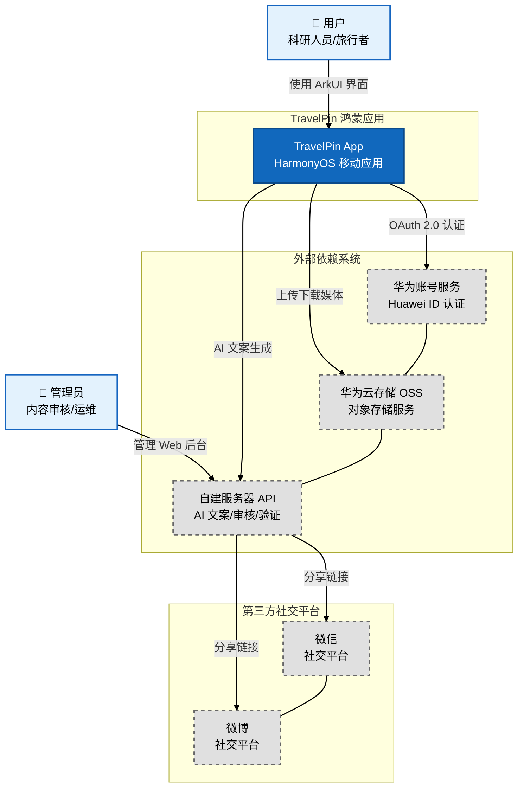

# C4 Level 1 - 系统上下文图 (System Context Diagram)

**生成日期**: 2026-04-16  
**系统名称**: TravelPin - 鸿蒙地理位置旅行日记应用

---

## Mermaid 架构图



---

## 设计说明

### 用户角色

| 角色 | 描述 |
|------|------|
| **用户** | 科研人员、旅行者等核心用户群体，使用鸿蒙设备记录旅行回忆 |
| **管理员** | 负责内容审核、系统运维的后台人员 |

### 系统边界

| 系统 | 类型 | 说明 |
|------|------|------|
| **TravelPin App** | 本系统 | 鸿蒙原生应用，包含前端 UI、本地 RDB 数据库、离线优先架构 |
| **华为账号服务** | 外部依赖 | 提供用户认证与登录能力 |
| **华为云存储 OSS** | 外部依赖 | 存储原始照片与媒体文件（保留完整 EXIF） |
| **自建服务器 API** | 外部依赖 | 提供 AI 文案生成、内容审核、分享链接验证等服务 |
| **微信/微博** | 外部依赖 | 第三方社交平台，用于分享内容展示 |

### 数据流向

1. **用户 → TravelPin App**: 通过 ArkUI 界面进行交互
2. **TravelPin App → 华为账号**: OAuth 2.0 认证登录
3. **TravelPin App → 华为云 OSS**: 上传原始照片（含 EXIF），下载媒体文件
4. **TravelPin App → 自建服务器**: 发送脱敏元数据请求 AI 文案生成
5. **自建服务器 → 微信/微博**: 生成带 HMAC 签名的分享链接

---

## 设计动机

1. **明确系统边界**: 清晰区分应用内部与外部依赖，避免将第三方服务视为系统一部分
2. **突出数据主权**: 原始照片存储于华为云（不出华为生态），元数据由自建服务器处理
3. **安全设计前置**: 标注 HMAC 签名、OAuth 2.0 等安全机制

## 隐藏假设

- 所有网络通信必须使用 HTTPS
- 华为账号 SDK 已预装在鸿蒙设备上
- 自建服务器与华为云存储之间的通信是内网或可信通道

## 工具链建议

如需将此 Mermaid 转为 SVG 图片：

```bash
# 安装 mmdc (Mermaid CLI)
npm install -g @mermaid-js/mermaid-cli

# 转换为 SVG
mmdc -i C4_Level1_SystemContext.md -o C4_Level1_SystemContext.svg -w 1200
```

---

**下一张**: [C4 Level 2 - 容器图](./C4_Level2_Container.md)
