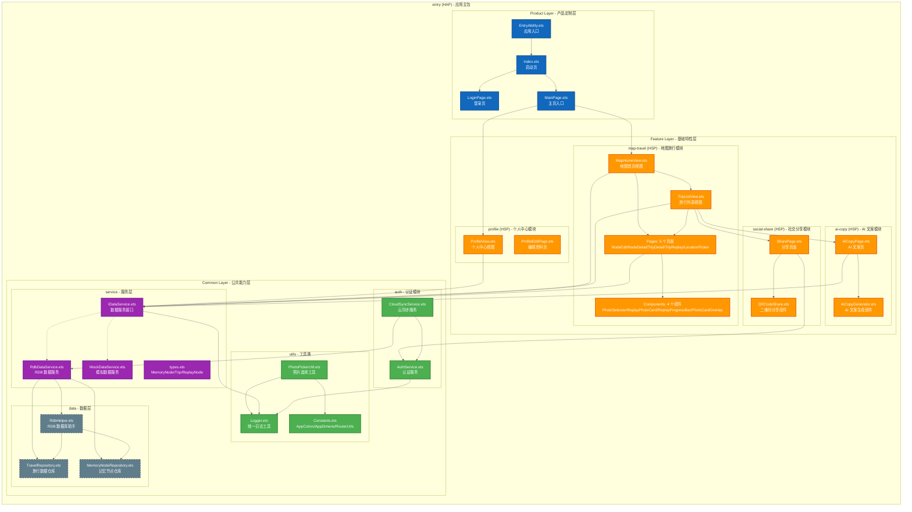

# C4 Level 2 - 容器图 (Container Diagram)

**生成日期**: 2026-04-16  
**系统名称**: TravelPin 鸿蒙应用  
**分析范围**: `frontend/entry/src/main/ets/`

---

## Mermaid 架构图



---

## 容器说明

### Product Layer (产品定制层) - Entry (HAP)

| 容器 | 职责 | 技术栈 |
|------|------|--------|
| **EntryAbility.ets** | 应用入口，初始化数据库、网络监听、云服务 | UIAbility |
| **Index.ets** | 启动页/欢迎页，路由分发 | ArkUI Page |
| **LoginPage.ets** | 用户登录页面 | ArkUI Page |
| **MainPage.ets** | 主页入口，承载各个 Feature View | ArkUI Page |

### Feature Layer (基础特性层) - 4 个 HSP 模块

#### map-travel (HSP) - 地图旅行核心模块
| 文件 | 功能 |
|------|------|
| `MapHomeView.ets` | 地图首页、节点展示 |
| `TripListView.ets` | 旅行列表、导航入口 |
| `pages/` | 5 个功能页面 (NodeEdit/NodeDetail/TripDetail/TripReplay/LocationPicker) |
| `components/` | 4 个 UI 组件 (PhotoSelector/ReplayPhotoCard/ReplayProgressBar/PhotoCardOverlay) |

#### profile (HSP) - 个人中心模块
| 文件 | 功能 |
|------|------|
| `ProfileView.ets` | 用户信息、设置入口 |
| `ProfileEditPage.ets` | 编辑用户资料 |

#### social-share (HSP) - 社交分享模块
| 文件 | 功能 |
|------|------|
| `SharePage.ets` | 分享链接生成、平台选择 |
| `QRCodeShare.ets` | 二维码生成组件 |

#### ai-copy (HSP) - AI 文案生成模块
| 文件 | 功能 |
|------|------|
| `AiCopyPage.ets` | 文案风格选择、生成结果展示 |
| `AiCopyGenerator.ets` | AI 文案生成逻辑 |

### Common Layer (公共能力层) - HAR 基础库

| 子模块 | 文件 | 功能 |
|--------|------|------|
| **utils** | Logger.ets | 统一日志工具 |
| | Constants.ets | AppColors, AppDimens, RouterUrls |
| | PhotoPickerUtil.ets | 系统相册选择、沙箱存储 |
| **service** | IDataService.ets | 数据服务接口 (11 个方法) |
| | RdbDataService.ets | RDB 数据实现 |
| | MockDataService.ets | 模拟数据实现 |
| | types.ets | MemoryNode, Trip, ReplayNode, ReplayRoute |
| **data** | RdbHelper.ets | SQLite 数据库助手 |
| | TravelRepository.ets | 旅行 CRUD |
| | MemoryNodeRepository.ets | 记忆节点 CRUD |
| **auth** | AuthService.ets | 华为账号认证、会话管理 |
| | CloudSyncService.ets | 云同步服务 |

---

## 数据流向

```
用户交互 → Product Pages → Feature Views → Service Interface
                                      ↓
                              RdbDataService → RdbHelper → Repositories
                                      ↓
                              Local RDB (SQLite)
```

---

## 设计动机

1. **三层架构清晰分层**: Product 层负责 UI 编排，Feature 层封装业务逻辑，Common 层提供基础能力
2. **模块职责单一**: 每个 Feature 模块 (HSP) 只关注一个业务领域
3. **依赖倒置**: Feature 层通过 IDataService 接口访问数据，而非直接依赖实现

## 隐藏假设

- 所有网络请求必须经过拦截器（统一处理 Token、错误）
- RDB 数据库在应用启动时初始化完成
- AuthService 在 EntryAbility 中全局初始化

## 工具链建议

```bash
# 转换为 SVG
mmdc -i C4_Level2_Container.md -o C4_Level2_Container.svg -w 1600
```

---

**上一张**: [C4 Level 1 - 系统上下文图](./C4_Level1_SystemContext.md)  
**下一张**: [C4 Level 3 - 组件图](./C4_Level3_Component.md)
