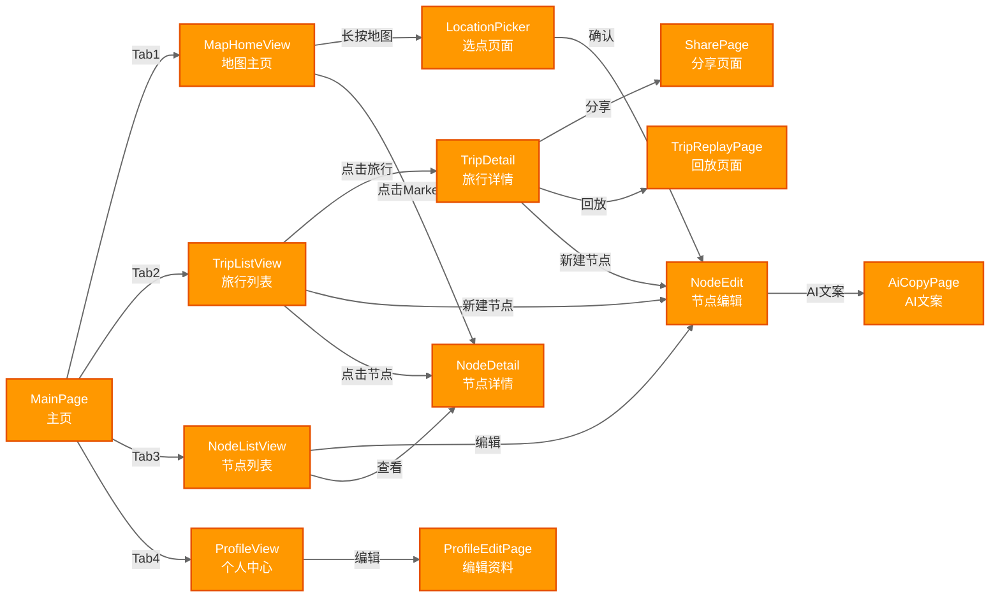

# C4 Level 2 - 容器图 (Container Diagram)

**生成日期**: 2026-04-18  
**系统名称**: TravelPin 鸿蒙应用  
**分析范围**: `frontend/entry/src/main/ets/`

---

## 设计说明

本文档采用 **分层表达策略**，将复杂架构拆分为两个视角：

1. **架构图（模块边界视角）**：展示三层架构、模块边界、调用关系
2. **导航流程图（页面跳转视角）**：展示页面跳转路径、触发条件

---

## Mermaid 架构图（简化版 - 模块边界视角）

**核心思路**：
- **三层蛋糕结构**：Product → Feature → Common 垂直排列
- **模块边界清晰**：每个模块用 subgraph 包裹
- **调用关系聚合**：用一个箭头代表模块间调用关系（减少箭头交叉）

```mermaid
flowchart TB
    %% 样式定义
    classDef entry fill:#1168bd,stroke:#0b4a8a,stroke-width:2px,color:#fff
    classDef feature fill:#ff9800,stroke:#e65100,stroke-width:2px,color:#fff
    classDef common fill:#4caf50,stroke:#2e7d32,stroke-width:2px,color:#fff
    classDef service fill:#9c27b0,stroke:#6a1b9a,stroke-width:2px,color:#fff
    classDef storage fill:#607d8b,stroke:#455a64,stroke-width:2px,stroke-dasharray:5 5,color:#fff
    classDef module fill:#f5f5f5,stroke:#333,stroke-width:1px,color:#000

    %% ==================== Product Layer ====================
    subgraph ProductLayer["Product Layer - 产品定制层"]
        direction LR
        
        %% entry 模块
        subgraph EntryModule["entry (应用入口)"]
            EntryAbility["EntryAbility<br/>应用入口"]:::entry
        end
        
        %% pages 模块
        subgraph PagesModule["pages (页面层)"]
            direction TB
            Index["Index<br/>启动页"]:::entry
            LoginPage["LoginPage<br/>登录页"]:::entry
            MainPage["MainPage<br/>主页(4个Tab)"]:::entry
        end
    end

    %% ==================== Feature Layer ====================
    subgraph FeatureLayer["Feature Layer - 基础特性层"]
        direction LR
        
        %% map-travel 核心模块
        subgraph MapTravelModule["map-travel 模块"]
            direction TB
            MainViews["主页视图<br/>MapHomeView<br/>TripListView<br/>NodeListView"]:::module
            DetailPages["详情页面<br/>NodeDetail<br/>TripDetail"]:::module
            EditPages["编辑页面<br/>NodeEdit<br/>TripEdit"]:::module
            UtilityPages["工具页面<br/>LocationPicker"]:::module
        end
        
        %% replay 模块
        subgraph ReplayModule["replay 模块"]
            direction TB
            ReplayPage["TripReplayPage<br/>回放页面"]:::feature
            ReplayComponents["回放组件<br/>PhotoCard<br/>ProgressBar<br/>Overlay"]:::module
        end
        
        %% ai-copy 模块
        subgraph AiCopyModule["ai-copy 模块"]
            direction TB
            AiCopyPage["AiCopyPage<br/>AI文案页"]:::feature
            AiCopyGenerator["AiCopyGenerator<br/>生成组件"]:::module
        end
        
        %% social-share 模块
        subgraph SocialShareModule["social-share 模块"]
            direction TB
            SharePage["SharePage<br/>分享页面"]:::feature
            QRCodeShare["QRCodeShare<br/>二维码组件"]:::module
        end
        
        %% profile 模块
        subgraph ProfileModule["profile 模块"]
            direction TB
            ProfileView["ProfileView<br/>个人中心"]:::feature
            ProfileEditPage["ProfileEditPage<br/>编辑资料"]:::module
        end
    end

    %% ==================== Common Layer ====================
    subgraph CommonLayer["Common Layer - 公共能力层"]
        direction LR
        
        %% utils 子模块
        subgraph UtilsModule["utils (工具类)"]
            direction TB
            Logger["Logger<br/>日志工具"]:::common
            Constants["Constants<br/>颜色/路由/尺寸"]:::common
            PhotoPickerUtil["PhotoPickerUtil<br/>照片+沙箱"]:::common
        end
        
        %% location 子模块
        subgraph LocationModule["location (地图定位)"]
            direction TB
            MapService["MapService<br/>地点搜索"]:::common
            LocationService["LocationService<br/>定位"]:::common
        end
        
        %% service 子模块
        subgraph ServiceModule["service (数据服务)"]
            direction TB
            IDataService["IDataService<br/>数据接口"]:::service
            RdbDataService["RdbDataService<br/>RDB实现"]:::service
            MockDataService["MockDataService<br/>模拟数据"]:::service
            Types["types<br/>MemoryNode<br/>Trip"]:::service
            
            %% 内部调用关系
            IDataService -->|"implements"| RdbDataService
            IDataService -->|"implements"| MockDataService
            RdbDataService -->|"uses"| Types
            MockDataService -->|"uses"| Types
        end
        
        %% data 子模块
        subgraph DataModule["data (数据层)"]
            direction TB
            RdbHelper["RdbHelper<br/>数据库助手"]:::storage
            TravelRepo["TravelRepo<br/>旅行仓库"]:::storage
            MemoryNodeRepo["MemoryNodeRepo<br/>节点仓库"]:::storage
        end
        
        %% auth 子模块
        subgraph AuthModule["auth (认证模块)"]
            direction TB
            AuthService["AuthService<br/>认证"]:::common
            CloudSync["CloudSync<br/>云同步"]:::common
        end
        
        %% media 子模块
        subgraph MediaModule["media (媒体服务)"]
            direction TB
            AudioService["AudioService<br/>音频"]:::common
        end
    end

    %% ==================== 层级调用关系（聚合箭头）====================
    
    %% Product -> Feature
    ProductLayer ==>|"路由分发"| FeatureLayer
    
    %% Product -> Common
    PagesModule -.->|"华为账号认证"| AuthModule
    
    %% Feature -> Common（按模块分组，减少箭头数量）
    MapTravelModule -.->|"数据CRUD"| ServiceModule
    MapTravelModule -.->|"地图定位"| LocationModule
    MapTravelModule -.->|"照片选择"| UtilsModule
    
    ReplayModule -.->|"数据读取"| ServiceModule
    ReplayModule -.->|"日志记录"| UtilsModule
    ReplayModule -.->|"音乐播放"| MediaModule
    
    AiCopyModule -.->|"AI调用"| ServiceModule
    
    SocialShareModule -.->|"认证"| AuthModule
    
    ProfileModule -.->|"数据CRUD"| ServiceModule
    
    %% Common 内部调用（简化）
    ServiceModule --> DataModule
    DataModule -->|"SQL操作"| RdbHelper
    AuthModule --> ServiceModule
    LocationModule --> UtilsModule
    MediaModule --> UtilsModule

    %% 布局优化：增加层级间距
    linkStyle default stroke:#666,stroke-width:2px
```



---

## 导航流程图（页面跳转详细视角）

**设计说明**：
- **横向布局**：减少箭头交叉
- **触发条件标注**：箭头旁标注跳转触发点



---

## 容器说明

### Product Layer (产品定制层)

| 容器 | 职责 | 技术栈 |
|------|------|--------|
| **EntryAbility.ets** | 应用入口，初始化数据库、网络监听 | UIAbility |
| **Index.ets** | 启动页/欢迎页，路由分发 | ArkUI Page |
| **LoginPage.ets** | 用户登录页面 | ArkUI Page |
| **MainPage.ets** | 主页入口，承载 4 个 Feature View | ArkUI Page |

### Feature Layer (基础特性层)

#### map-travel 模块 (地图旅行核心)

| 文件 | 功能 | 触发入口 |
|------|------|---------|
| `MapHomeView.ets` | 地图首页、节点展示 | MainPage Tab1 |
| `TripListView.ets` | 旅行列表、导航入口 | MainPage Tab2 |
| `NodeListView.ets` | 节点列表、编辑入口 | MainPage Tab3 |
| `NodeEditPage.ets` | 节点编辑（标题、内容、照片） | 长按地图/点击新建 |
| `NodeDetailPage.ets` | 节点详情查看 | 点击 Marker |
| `TripDetailPage.ets` | 旅行详情、回放入口 | 点击旅行卡片 |
| `LocationPickerPage.ets` | 地图选点 | 长按地图触发 |

#### replay 模块 (轨迹回放)

| 文件 | 功能 | 触发入口 |
|------|------|---------|
| `TripReplayPage.ets` | 回放页面 | TripDetail → "回放轨迹" |
| `ReplayPhotoCard.ets` | 回放时照片卡片 | TripReplayPage 内部组件 |
| `ReplayProgressBar.ets` | 回放进度控制 | TripReplayPage 内部组件 |
| `PhotoCardOverlay.ets` | 照片叠加动画 | TripReplayPage 内部组件 |

#### ai-copy 模块 (AI 文案生成)

| 文件 | 功能 | 触发入口 |
|------|------|---------|
| `AiCopyPage.ets` | 文案风格选择、结果展示 | NodeEdit → "编辑正文调用 AI" |
| `AiCopyGenerator.ets` | AI 文案生成逻辑 | AiCopyPage 内部组件 |

#### social-share 模块 (社交分享)

| 文件 | 功能 | 触发入口 |
|------|------|---------|
| `SharePage.ets` | 分享链接生成、平台选择 | TripDetail → "分享旅行" |
| `QRCodeShare.ets` | 二维码生成组件 | SharePage 内部组件 |

#### profile 模块 (个人中心)

| 文件 | 功能 | 触发入口 |
|------|------|---------|
| `ProfileView.ets` | 用户信息、设置入口 | MainPage Tab4 |
| `ProfileEditPage.ets` | 编辑用户资料 | ProfileView → "编辑" |

### Common Layer (公共能力层)

#### utils 子模块 (工具类)

| 文件 | 功能 |
|------|------|
| `Logger.ets` | 统一日志工具 (info/debug/warn/error) |
| `Constants.ets` | AppColors (颜色主题), RouterUrls (路由路径), AppDimens (尺寸间距) |
| `PhotoPickerUtil.ets` | 照片选择工具 (访问相册 + 沙箱存储) |

#### location 子模块 (地图定位服务)

| 文件 | 功能 | 调用方 |
|------|------|---------|
| `MapService.ets` | 地点搜索、经纬度转换 | MapHomeView, LocationPicker |
| `LocationService.ets` | 获取当前位置 | MapHomeView, LocationPicker |

#### service 子模块 (数据服务)

| 文件 | 功能 |
|------|------|
| `IDataService.ets` | 数据服务接口 (11 个 CRUD 方法) |
| `RdbDataService.ets` | RDB 数据实现 (SQLite 封装) |
| `MockDataService.ets` | 模拟数据服务 (开发测试用) |
| `types.ets` | MemoryNode, Trip, ReplayNode 类型定义 |

#### data 子模块 (数据层)

| 文件 | 功能 |
|------|------|
| `RdbHelper.ets` | RDB 数据库助手 (初始化/连接管理) |
| `TravelRepository.ets` | 旅行数据仓库 (Travel CRUD) |
| `MemoryNodeRepository.ets` | 记忆节点仓库 (MemoryNode CRUD) |

#### auth 子模块 (认证模块)

| 文件 | 功能 |
|------|------|
| `AuthService.ets` | 华为账号认证、会话管理 |
| `CloudSyncService.ets` | 云同步服务 (数据云端备份) |

#### media 子模块 (媒体服务)

| 文件 | 功能 | 调用方 |
|------|------|---------|
| `AudioService.ets` | 内置音乐播放 | TripReplayPage |

---

## 数据流向

```
用户交互 → Product Pages → Feature Views → Service Interface
                                      ↓
                              RdbDataService → RdbHelper → Repositories
                                      ↓
                              Local RDB (SQLite)
```

---

## 设计动机

1. **三层架构清晰分层**: Product 层负责 UI 编排，Feature 层封装业务逻辑，Common 层提供基础能力
2. **模块职责单一**: 每个 Feature 模块只关注一个业务领域
3. **依赖倒置**: Feature 层通过 IDataService 接口访问数据，而非直接依赖实现
4. **服务封装**: 地图定位服务封装到 Common 层，避免 Feature 层直接调用系统 API

---

## 重构建议

### Common Layer 待封装模块

| 模块 | 当前状态 | 建议 |
|------|---------|------|
| **地图服务** | 直接在 Feature 调用 `@kit.LocationKit` | 封装为 `MapService.ets` + `LocationService.ets` |
| **照片沙箱存储** | ✅ 已封装 `PhotoPickerUtil.ets` | 保留现有实现 |
| **内置音乐** | ❌ 未实现 | 封装为 `AudioService.ets` |

---

## 工具链建议

```bash
# 转换为 SVG
mmdc -i C4_Level2_Container.md -o C4_Level2_Container.svg -w 2400 -b white
```

---

**上一张**: [C4 Level 1 - 系统上下文图](./C4_Level1_SystemContext.md)  
**下一张**: [C4 Level 3 - 组件图](./C4_Level3_Component.md)