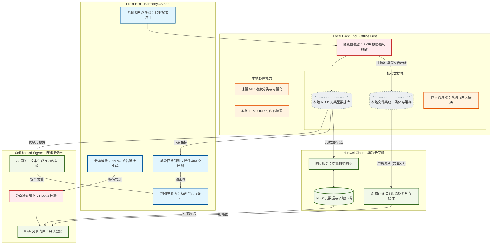

# 旅行记忆地图 - 软件架构图

**最后更新**: 2026-03-25 (Pages Framework Complete)

---

## 当前架构 (2026-03-25 更新)

基于四层架构设计：Product (产品定制层) → Feature (基础特性层) → Service (服务层) → Common (公共能力层)

```mermaid
graph TD
    %% 样式定义 - 基于实际实现的四层架构
    classDef product fill:#e3f2fd,stroke:#1565c0,stroke-width:2px;
    classDef feature fill:#fff3e0,stroke:#e65100,stroke-width:2px;
    classDef service fill:#f3e5f5,stroke:#7b1fa2,stroke-width:2px;
    classDef common fill:#f1f8e9,stroke:#33691e,stroke-width:2px;
    classDef security fill:#ffebee,stroke:#c62828,stroke-width:2px;
    classDef storage fill:#eceff1,stroke:#455a64,stroke-dasharray: 5 5;

    %% --- Product Layer (产品定制层) ---
    subgraph Product [Product Layer - 产品定制层]
        EntryAbility[EntryAbility: 应用入口]:::product
        Index[Index.ets: 地图首页]:::product
        TravelEditor[TravelEditor.ets: 旅行编辑页]:::product
        RouteEditor[RouteEditor.ets: 路线编辑页]:::product
        AiCopy[AiCopy.ets: AI 文案生成页]:::product
        Share[Share.ets: 分享页]:::product
        Login[Login.ets: 登录页]:::product
    end

    %% --- Feature Layer (基础特性层) ---
    subgraph Feature [Feature Layer - 基础特性层]
        direction TB

        subgraph MapTravel [map-travel: 地图旅行核心模块]
            MapTravelComponent[MapTravelComponent: 地图旅行组件]:::feature
            PhotoPicker[PhotoPicker: 照片选择器]:::feature
        end

        subgraph SocialShare [social-share: 社交分享模块]
            QRCodeShare[QRCodeShare: 二维码分享]:::feature
        end

        subgraph RouteEditor [route-editor: 路线编辑模块]
            RouteEditorComponent[RouteEditorComponent: 路线编辑组件]:::feature
            PlaybackEngine[PlaybackEngine: 轨迹回放引擎]:::feature
        end

        subgraph AiCopy [ai-copy: AI 文案模块]
            AiCopyGenerator[AiCopyGenerator: AI 文案生成组件]:::feature
        end
    end

    %% --- Service Layer (服务层) - NEW 2026-03-25 ---
    subgraph Service [Service Layer - 服务层]
        direction TB

        subgraph MockServices [Mock Services (开发阶段)]
            MockDataService[MockDataService: 模拟数据服务]:::service
        end

        subgraph Interfaces [Service Interfaces (待实现)]
            IDataService[IDataService: 数据服务接口]:::service
            IMLService[IMLService: 机器学习服务接口]:::service
            IAuthService[IAuthService: 认证服务接口]:::service
            IShareService[IShareService: 分享服务接口]:::service
            ISyncService[ISyncService: 同步服务接口]:::service
        end
    end

    %% --- Common Layer (公共能力层) ---
    subgraph Common [Common Layer - 公共能力层]
        direction TB

        subgraph Utils [utils]
            Logger[Logger.ets: 统一日志工具]:::common
            Constants[Constants.ets: 统一常量定义]:::common
            EventHub[EventHub.ets: 事件总线]:::common
            CoordinateConverter[CoordinateConverter.ets: 坐标转换]:::common
        end

        subgraph API [api]
            HttpClient[HttpClient.ets: HTTP 客户端单例]:::common
            FileUploader[FileUploader.ets: 文件上传]:::common
            ApiEndpoints[ApiEndpoints.ets: API 端点定义]:::common
            AiGatewayClient[AiGatewayClient.ets: AI 网关客户端]:::common
            SharePortalClient[SharePortalClient.ets: 分享门户客户端]:::common
        end

        subgraph Data [data]
            LocalStorage[LocalStorage.ets: 本地持久化]:::storage
            RdbHelper[RdbHelper.ets: RDB 数据库助手]:::storage
            TravelRepository[TravelRepository.ets: 旅行数据仓库]:::storage
            MemoryNodeRepository[MemoryNodeRepository.ets: 记忆节点仓库]:::storage
        end

        subgraph Auth [auth]
            HuaweiAccountAuth[HuaweiAccountAuth.ets: 华为账号认证]:::common
            SessionManager[SessionManager.ets: 会话管理]:::common
        end

        subgraph AI [ai]
            LocalImageTagger[LocalImageTagger.ets: 本地图像标签]:::common
            MetadataAggregator[MetadataAggregator.ets: 元数据聚合]:::common
        end

        subgraph Security [security]
            ExifStripper[ExifStripper.ets: EXIF 脱敏]:::security
            ShareLinkSigner[ShareLinkSigner.ets: HMAC-SHA256 签名]:::security
        end
    end

    %% --- 数据流关系 (Data Flow) ---

    %% 应用入口
    EntryAbility --> Index

    %% Pages 调用 Service
    Index --> MockDataService
    TravelEditor --> MockDataService
    RouteEditor --> MockDataService
    AiCopy --> MockDataService
    Share --> MockDataService
    Login --> IDataService

    %% Pages 导航
    Index --> TravelEditor
    Index --> RouteEditor
    Index --> AiCopy
    Index --> Share
    Index --> Login

    %% Pages 依赖 Feature
    Index --> MapTravelComponent
    TravelEditor --> RouteEditorComponent
    AiCopy --> AiCopyGenerator
    Share --> QRCodeShare

    %% Feature 内部
    PhotoPicker --> MapTravelComponent
    RouteEditorComponent --> PlaybackEngine

    %% Feature/Service 依赖 Common
    MapTravelComponent --> CoordinateConverter
    MapTravelComponent --> EventHub
    MockDataService --> Logger
    MockDataService --> RdbHelper

    %% API 调用
    FileUploader --> HttpClient
    HttpClient --> ApiEndpoints
    AiGatewayClient --> HttpClient
    SharePortalClient --> HttpClient

    %% 安全流程
    PhotoPicker -.-> ExifStripper
    QRCodeShare --> ShareLinkSigner

    %% 数据存储
    RdbHelper --> LocalStorage
    TravelRepository --> RdbHelper
    MemoryNodeRepository --> RdbHelper
```

---

## 四层架构说明

| 层级 | 职责 | 关键模块 |
|------|------|---------|
| **Product Layer** | UI 编排与导航 | 6 个 Pages (Index, TravelEditor, RouteEditor, AiCopy, Share, Login) |
| **Feature Layer** | 业务逻辑封装 | MapTravel, SocialShare, RouteEditor, AiCopy Components |
| **Service Layer** | 统一服务接口 | MockDataService (开发中), 5 个 Service 接口 (待实现) |
| **Common Layer** | 基础工具与能力 | Utils, API, Data, Auth, AI, Security |

---

## Service Layer 接口定义

详见 `reference/task/SERVICE_INTERFACES.md`

| Service | 接口 | 方法数 | 负责人 |
|---------|------|--------|--------|
| DataService | IDataService | 11 | 数据库队友 |
| MLService | IMLService | 6 | ML 队友 |
| AuthService | IAuthService | 7 | 认证队友 |
| ShareService | IShareService | 7 | 分享队友 |
| SyncService | ISyncService | 8 | 云同步队友 |

---

## Pages 功能矩阵

| Page | 功能 | 依赖 Service | 路由参数 |
|------|------|-------------|---------|
| Index | 地图首页、旅行选择、导航枢纽 | MockDataService | - |
| TravelEditor | 旅行信息编辑 | MockDataService | travelId |
| RouteEditor | 路线编辑、节点排序 | MockDataService | travelId |
| AiCopy | AI 文案生成、风格选择 | MockDataService | travelId |
| Share | 分享链接生成、二维码 | MockDataService | travelId, copy |
| Login | 华为账号登录 | IAuthService (待实现) | - |

---

## 原始设计架构 (参考)

> 包含云端服务的完整设计，待后续实现



---

## 架构变更历史

| 日期 | 变更项 | 说明 |
|------|--------|------|
| 2026-03-25 | 新增 Service Layer | 定义 5 个 Service 接口，添加 MockDataService |
| 2026-03-25 | Pages 扩展 | 从 2 个 Pages 扩展到 6 个 (Index, TravelEditor, RouteEditor, AiCopy, Share, Login) |
| 2026-03-25 | 路由系统 | 启用 @kit.ArkUI router，实现页面导航 |
| 2026-03-21 | 初始架构 | Product/Feature/Common 三层架构 |

---

## 待实现模块

| 模块 | 状态 | 优先级 |
|------|------|--------|
| DataService 真实实现 | ⏳ 待实现 | High |
| MLService 真实实现 | ⏳ 待实现 | High |
| AuthService 真实实现 | ⏳ 待实现 | High |
| ShareService 真实实现 | ⏳ 待实现 | Medium |
| SyncService 真实实现 | ⏳ 待实现 | Medium |
| 云端服务层 | ❌ 未开始 | Low |
| Web 分享门户 | ❌ 未开始 | Low |
