# 旅行记忆地图 - 前端架构 submodule

**最后更新**: 2026-03-25 (Pages Framework Complete)

---

## 前端四层架构图

```mermaid
graph TD
    %% 样式定义
    classDef product fill:#e3f2fd,stroke:#1565c0,stroke-width:2px;
    classDef feature fill:#fff3e0,stroke:#e65100,stroke-width:2px;
    classDef service fill:#f3e5f5,stroke:#7b1fa2,stroke-width:2px;
    classDef common fill:#f1f8e9,stroke:#33691e,stroke-width:2px;

    %% --- Product Layer ---
    subgraph Product [Product Layer - UI 编排与导航]
        Index[Index.ets: 地图首页]:::product
        TravelEditor[TravelEditor.ets: 旅行编辑]:::product
        RouteEditor[RouteEditor.ets: 路线编辑]:::product
        AiCopy[AiCopy.ets: AI 文案]:::product
        Share[Share.ets: 分享页]:::product
        Login[Login.ets: 登录页]:::product
    end

    %% --- Feature Layer ---
    subgraph Feature [Feature Layer - 业务逻辑封装]
        MapTravelComponent[MapTravelComponent: 地图组件]:::feature
        PhotoPicker[PhotoPicker: 照片选择]:::feature
        RouteEditorComponent[RouteEditorComponent: 路线编辑]:::feature
        AiCopyGenerator[AiCopyGenerator: AI 文案生成]:::feature
        QRCodeShare[QRCodeShare: 二维码分享]:::feature
    end

    %% --- Service Layer ---
    subgraph Service [Service Layer - 统一服务接口]
        MockDataService[MockDataService: 模拟数据服务]:::service
        IDataService[IDataService: 数据服务接口]:::service
        IMLService[IMLService: ML 服务接口]:::service
        IAuthService[IAuthService: 认证服务接口]:::service
        IShareService[IShareService: 分享服务接口]:::service
    end

    %% --- Common Layer ---
    subgraph Common [Common Layer - 基础工具]
        Logger[Logger.ets]:::common
        HttpClient[HttpClient.ets]:::common
        RdbHelper[RdbHelper.ets]:::common
        EventHub[EventHub.ets]:::common
        CoordinateConverter[CoordinateConverter.ets]:::common
    end

    %% 数据流
    Index --> MapTravelComponent
    Index --> MockDataService
    TravelEditor --> MockDataService
    RouteEditor --> RouteEditorComponent
    AiCopy --> AiCopyGenerator
    Share --> QRCodeShare

    MapTravelComponent --> CoordinateConverter
    MapTravelComponent --> EventHub
    MockDataService --> RdbHelper
    MockDataService --> Logger
```



---

## Pages 职责与功能

| Page | 职责 | 主要功能 | 依赖 Service |
|------|------|---------|-------------|
| **Index** | 地图首页/导航枢纽 | 旅行选择、地图展示、快捷导航 | MockDataService |
| **TravelEditor** | 旅行信息编辑 | 名称/描述/日期编辑 | MockDataService |
| **RouteEditor** | 路线编辑 | 节点列表、拖拽排序、增删节点 | MockDataService |
| **AiCopy** | AI 文案生成 | 风格选择、草稿输入、文案生成 | MockDataService |
| **Share** | 分享 | 链接生成、二维码、分享选项 | MockDataService |
| **Login** | 认证 | 华为账号登录、用户协议 | IAuthService (待实现) |

---

## Service Layer 设计

### 为什么需要 Service Layer？

1. **解耦**: Pages/Components 不直接依赖 RdbHelper 等底层实现
2. **并行开发**: 先定义接口，Pages 用 Mock 开发，队友实现真实 Service
3. **可测试**: Service 可以被 mock，便于单元测试
4. **单一职责**: 每个 Service 只负责一个领域

### 接口定义总览

```typescript
// 详见 reference/task/SERVICE_INTERFACES.md

interface IDataService {
  // Travel CRUD (5 个方法)
  // TravelNode CRUD (6 个方法)
}

interface IMLService {
  // 图片分析 (3 个方法)
  // 文案生成 (2 个方法)
  // 内容审核 (1 个方法)
}

interface IAuthService {
  // 登录/登出 (4 个方法)
  // 会话管理 (3 个方法)
}

interface IShareService {
  // 分享链接生成 (2 个方法)
  // 分享验证 (2 个方法)
  // 安全 (2 个方法)
}

interface ISyncService {
  // 同步控制 (5 个方法)
  // 冲突解决 (3 个方法)
}
```

---

## 数据流向

```
用户交互
   ↓
Pages (UI 编排)
   ↓
Service Layer (数据/能力)
   ↓
Common Layer (基础工具)
   ↓
HarmonyOS SDK (@kit.*)
```

---

## 模块依赖关系

```
product/entry/src/main/ets/pages/
├── Index.ets
│   ├── imports: MockDataService, MapTravelComponent
│   └── navigation: TravelEditor, RouteEditor, AiCopy, Share, Login
│
├── TravelEditor.ets
│   ├── imports: MockDataService, router
│   └── params: travelId
│
├── RouteEditor.ets
│   ├── imports: MockDataService, router
│   └── params: travelId
│
├── AiCopy.ets
│   ├── imports: MockDataService, router
│   └── params: travelId
│
├── Share.ets
│   ├── imports: MockDataService, router
│   └── params: travelId, copy
│
└── Login.ets
    ├── imports: router (IAuthService 待实现)
    └── navigation: back()
```

---

## DevEco Studio 预览器支持

所有 Pages 都支持在 Previewer 中展示：

| Page | Mock 数据 | 可展示内容 | 页面流转 |
|------|----------|-----------|---------|
| Index | ✅ 2 个旅行 | 旅行选择器、地图占位 | → 所有 Pages |
| TravelEditor | ✅ | 表单输入 | ← back |
| RouteEditor | ✅ 4 个节点 | 节点列表、排序按钮 | ← back |
| AiCopy | ✅ 4 种风格 | 风格选择器、文案展示 | ← back, → Share |
| Share | ✅ | 二维码占位、分享选项 | ← back |
| Login | ✅ | 登录按钮、协议 | ← back |

---

## 下一步工作

### Service 实现（队友任务）

| Service | 负责人 | 状态 | 接口文档 |
|---------|--------|------|---------|
| DataService | 数据库队友 | ⏳ | SERVICE_INTERFACES.md §3.1 |
| MLService | ML 队友 | ⏳ | SERVICE_INTERFACES.md §3.2 |
| AuthService | 认证队友 | ⏳ | SERVICE_INTERFACES.md §3.3 |
| ShareService | 分享队友 | ⏳ | SERVICE_INTERFACES.md §3.4 |
| SyncService | 云同步队友 | ⏳ | SERVICE_INTERFACES.md §3.5 |

### 集成步骤

1. 队友实现各自 Service
2. 替换 Pages 中的 `new MockDataService()` 为真实 Service
3. 测试端到端流程

---

## 参考文档

- `reference/task/SERVICE_INTERFACES.md` - Service 接口完整定义
- `reference/task/F1_local_storage_assignment.md` - 数据存储层任务分配
- `memory/01_project_state.md` - 当前项目状态
- `memory/03_task_backlog.md` - 任务清单
