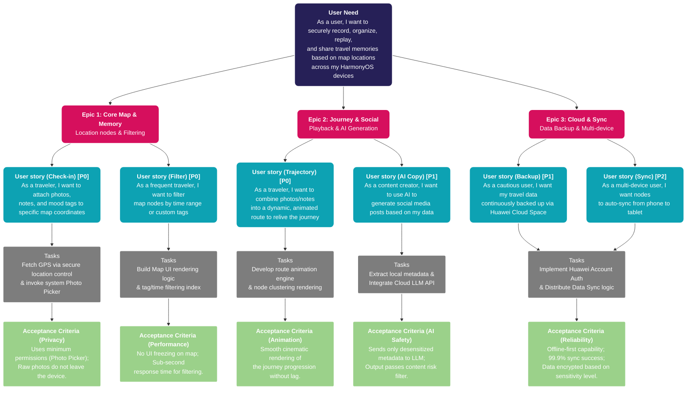

# User Story Map

This diagram shows the decomposition from high-level user needs down to epics, user stories, tasks, and acceptance criteria.

```mermaid
graph TD
    %% 定义颜色与样式
    classDef need fill:#262057,stroke:#fff,stroke-width:2px,color:#fff,rx:10px,ry:10px;
    classDef epic fill:#D60F5D,stroke:#fff,stroke-width:2px,color:#fff,rx:10px,ry:10px;
    classDef story fill:#0DA2B3,stroke:#fff,stroke-width:2px,color:#fff,rx:10px,ry:10px;
    classDef task fill:#7D7D7D,stroke:#fff,stroke-width:2px,color:#fff,rx:4px,ry:4px;
    classDef criteria fill:#9BD18A,stroke:#fff,stroke-width:2px,color:#fff,rx:4px,ry:4px;

    %% 高层用户需求
    UN["<b>User Need</b><br/>As a user, I want to securely record, organize, replay,<br/>and share travel memories based on map locations<br/>across my HarmonyOS devices"]:::need

    %% 史诗 Epic 划分 (根据新的 Story 分组)
    E1["<b>Epic 1: Core Map & Memory</b><br/>Location nodes & Filtering"]:::epic
    E2["<b>Epic 2: Journey & Social</b><br/>Playback & AI Generation"]:::epic
    E3["<b>Epic 3: Cloud & Sync</b><br/>Data Backup & Multi-device"]:::epic

    UN --> E1
    UN --> E2
    UN --> E3

    %% 用户故事 User Stories (带优先级)
    US1["<b>User story (Check-in) [P0]</b><br/>As a traveler, I want to attach photos,<br/>notes, and mood tags to specific map coordinates"]:::story
    US2["<b>User story (Filter) [P0]</b><br/>As a frequent traveler, I want to filter<br/>map nodes by time range or custom tags"]:::story
    
    US3["<b>User story (Trajectory) [P0]</b><br/>As a traveler, I want to combine photos/notes<br/>into a dynamic, animated route to relive the journey"]:::story
    US4["<b>User story (AI Copy) [P1]</b><br/>As a content creator, I want to use AI to<br/>generate social media posts based on my data"]:::story
    
    US5["<b>User story (Backup) [P1]</b><br/>As a cautious user, I want my travel data<br/>continuously backed up via Huawei Cloud Space"]:::story
    US6["<b>User story (Sync) [P2]</b><br/>As a multi-device user, I want nodes<br/>to auto-sync from phone to tablet"]:::story

    %% 关联 Epic 和 Story
    E1 --> US1
    E1 --> US2
    
    E2 --> US3
    E2 --> US4
    
    E3 --> US5
    E3 --> US6

    %% 具体开发任务 Tasks (结合 Proposal 的技术需求)
    T1["Tasks<br/>Fetch GPS via secure location control<br/>& invoke system Photo Picker"]:::task
    T2["Tasks<br/>Build Map UI rendering logic<br/>& tag/time filtering index"]:::task
    T3["Tasks<br/>Develop route animation engine<br/>& node clustering rendering"]:::task
    T4["Tasks<br/>Extract local metadata &<br/>Integrate Cloud LLM API"]:::task
    T5["Tasks<br/>Implement Huawei Account Auth<br/>& Distribute Data Sync logic"]:::task

    US1 --> T1
    US2 --> T2
    US3 --> T3
    US4 --> T4
    US5 --> T5
    US6 --> T5

    %% 验收标准 Acceptance Criteria (结合 Proposal 的非功能需求)
    AC1["<b>Acceptance Criteria (Privacy)</b><br/>Uses minimum permissions (Photo Picker);<br/>Raw photos do not leave the device."]:::criteria
    AC2["<b>Acceptance Criteria (Performance)</b><br/>No UI freezing on map; Sub-second<br/>response time for filtering."]:::criteria
    AC3["<b>Acceptance Criteria (Animation)</b><br/>Smooth cinematic rendering of<br/>the journey progression without lag."]:::criteria
    AC4["<b>Acceptance Criteria (AI Safety)</b><br/>Sends only desensitized metadata to LLM;<br/>Output passes content risk filter."]:::criteria
    AC5["<b>Acceptance Criteria (Reliability)</b><br/>Offline-first capability; 99.9% sync success;<br/>Data encrypted based on sensitivity level."]:::criteria

    T1 --> AC1
    T2 --> AC2
    T3 --> AC3
    T4 --> AC4
    T5 --> AC5
```
